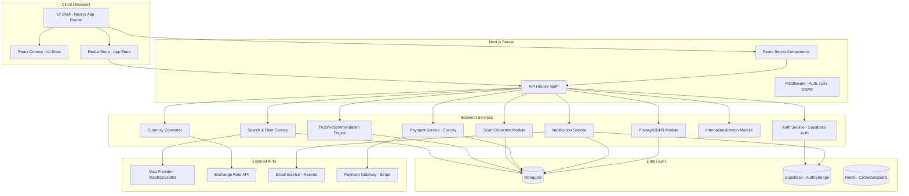

# Design Document: Apartment Finder

## Overview

Apartment Finder is a full-stack web application built with Next.js that helps expats in Europe find rental housing safely. The platform connects posters (landlords/tenants offering rooms) with seekers (people looking for housing) through a trust-based ecosystem with scam prevention, dual-party payment verification, and GDPR compliance.

The application uses a modern Apple-inspired UI with glassmorphism effects, dark mode with white and dark blue colors, parallax scrolling, and full responsiveness. It supports internationalization (6+ languages), currency conversion (10+ currencies), map-based geographic filtering, and a karma/trust recommendation system.

### Key Design Decisions

1. **Next.js App Router** — Chosen for SSR/SSG performance, SEO optimization, and API routes co-located with the frontend. The App Router provides React Server Components for faster initial loads.
2. **MongoDB (via Mongoose)** — Primary data store for listings, reviews, reports, and notifications. Its flexible schema suits the varied listing metadata and tag-based filtering.
3. **Supabase** — Handles authentication (email/password + OAuth), real-time subscriptions for notifications, and file storage for listing photos. Supabase's Row Level Security (RLS) enforces data access policies.
4. **Redux Toolkit + React Context** — Redux manages global state (session, listings cache, filters, payments). React Context handles local UI state (theme, language, notification panel). This separation keeps concerns clean.
5. **Tailwind CSS** — Utility-first CSS for rapid, consistent styling. Custom theme tokens for glassmorphism, dark/light mode, and the white/dark-blue palette.
6. **next-intl** — Internationalization library for Next.js App Router with ICU message format, locale-aware formatting, and no-reload language switching.

## Architecture



### Request Flow

1. **Browser** → Next.js Middleware (checks auth token, detects locale, validates GDPR consent)
2. **Middleware** → React Server Components (fetch data server-side for SSR)
3. **Client interactions** → API Routes → Service layer → Data layer
4. **Real-time events** → Supabase Realtime → Notification Service → Client via WebSocket

### Deployment Architecture

- **Hosting**: Vercel (Next.js optimized) or self-hosted with Docker
- **Database**: MongoDB Atlas (EU region for GDPR) + Supabase (EU region)
- **CDN**: Vercel Edge Network or Cloudflare for static assets and images
- **Cache**: Redis for session storage, exchange rates, and search result caching

## Components and Interfaces

### 1. Auth Service (`/lib/services/auth.ts`)

Wraps Supabase Auth. Handles registration, login, OAuth, email verification, password reset, and account lockout.

```typescript
interface AuthService {
  register(data: RegisterInput): Promise<AuthResult>;
  login(email: string, password: string): Promise<AuthResult>;
  loginWithOAuth(provider: 'google' | 'github'): Promise<AuthResult>;
  verifyEmail(token: string): Promise<void>;
  requestPasswordReset(email: string): Promise<void>;
  resetPassword(token: string, newPassword: string): Promise<void>;
  logout(): Promise<void>;
  getSession(): Promise<Session | null>;
}

interface RegisterInput {
  email: string;
  password: string;
  fullName: string;
  preferredLanguage: SupportedLocale;
}

interface AuthResult {
  user: User | null;
  error: string | null;
}
```

**Lockout logic**: Track failed login attempts in Redis with a TTL key `login:attempts:{email}`. After 3 failures, set a `login:locked:{email}` key with 15-minute TTL.

### 2. Listing Service (`/lib/services/listings.ts`)

CRUD operations for rental listings with validation, photo upload, and status management.

```typescript
interface ListingService {
  create(data: CreateListingInput, userId: string): Promise<Listing>;
  update(listingId: string, data: UpdateListingInput, userId: string): Promise<Listing>;
  publish(listingId: string, userId: string): Promise<Listing>;
  delete(listingId: string, userId: string): Promise<void>;
  getById(listingId: string): Promise<Listing | null>;
  getByUser(userId: string, status?: ListingStatus): Promise<Listing[]>;
  uploadPhotos(listingId: string, files: File[]): Promise<string[]>;
}

interface CreateListingInput {
  title: string;
  description: string;
  propertyType: 'apartment' | 'room' | 'house';
  address: Address;
  monthlyRent: number;
  currency: SupportedCurrency;
  availableDate: Date;
  photos: File[];
  tags: string[];
  isSharedAccommodation: boolean;
  currentOccupants?: number;
  availableRooms?: number;
  purpose: 'rent' | 'share' | 'sublet';
}
```

### 3. Filter & Search Service (`/lib/services/search.ts`)

Handles multi-criteria filtering, full-text search, and geographic boundary queries.

```typescript
interface SearchService {
  search(params: SearchParams): Promise<SearchResult>;
  searchWithinBoundary(params: SearchParams, boundary: GeoJSON.Polygon): Promise<SearchResult>;
}

interface SearchParams {
  query?: string;
  propertyType?: PropertyType;
  priceRange?: { min: number; max: number };
  bedrooms?: number;
  availableAfter?: Date;
  tags?: string[];
  purpose?: 'rent' | 'share' | 'sublet';
  isSharedAccommodation?: boolean;
  city?: string;
  neighborhood?: string;
  page: number;
  limit: number;
}

interface SearchResult {
  listings: Listing[];
  totalCount: number;
  page: number;
  totalPages: number;
}
```

**MongoDB indexes**: Compound index on `(status, propertyType, monthlyRent)`, text index on `(title, description, tags)`, 2dsphere index on `location` for geo queries.

### 4. Trust & Recommendation Engine (`/lib/services/trust.ts`)

Calculates trust scores from verified transactions, reviews, and profile completeness. Recent reviews weighted more heavily via time-decay.

```typescript
interface TrustService {
  calculateScore(userId: string): Promise<number>;
  submitReview(review: ReviewInput): Promise<Review>;
  getReviewsForUser(userId: string, limit?: number): Promise<Review[]>;
  getUserBadge(userId: string): Promise<'new_user' | 'trusted' | 'flagged'>;
  flagLowTrustUser(userId: string): Promise<void>;
}

interface ReviewInput {
  reviewerId: string;
  reviewedUserId: string;
  transactionId: string;
  rating: number; // 1-5
  comment: string;
}
```

**Score formula**: `score = Σ(rating_i × decay(age_i)) / Σ(decay(age_i)) × completeness_factor`
where `decay(age) = e^(-0.01 × age_in_days)` and `completeness_factor` is 0.5–1.0 based on profile fields filled.

### 5. Scam Detection Module (`/lib/services/scam-detection.ts`)

Analyzes listings for fraud patterns before publishing.

```typescript
interface ScamDetectionService {
  analyzeListing(listing: Listing): Promise<ScamAnalysisResult>;
  checkDuplicatePhotos(photoHashes: string[]): Promise<DuplicateResult[]>;
  checkPricingAnomaly(listing: Listing): Promise<boolean>;
}

interface ScamAnalysisResult {
  riskLevel: 'low' | 'medium' | 'high';
  flags: ScamFlag[];
  requiresReview: boolean;
}
```

**Detection strategies**: perceptual hashing (pHash) for duplicate photo detection, statistical pricing analysis against area median, NLP keyword scanning for known scam phrases.

### 6. Payment Service (`/lib/services/payments.ts`)

Escrow-based payment with dual-party confirmation via Stripe Connect.

```typescript
interface PaymentService {
  initiatePayment(data: PaymentInput): Promise<Payment>;
  confirmPayment(paymentId: string, userId: string): Promise<Payment>;
  cancelPayment(paymentId: string, reason: string): Promise<Payment>;
  raiseDispute(paymentId: string, userId: string, reason: string): Promise<Dispute>;
  getPaymentSummary(paymentId: string, userCurrency: SupportedCurrency): Promise<PaymentSummary>;
}

interface PaymentInput {
  seekerId: string;
  posterId: string;
  listingId: string;
  amount: number;
  currency: PaymentCurrency; // EUR, GBP, CHF, USD
}
```

**Escrow flow**: Stripe PaymentIntent created with `capture_method: 'manual'`. Funds captured only after both parties confirm. 72-hour auto-cancel via scheduled job.

### 7. Notification Service (`/lib/services/notifications.ts`)

```typescript
interface NotificationService {
  send(notification: NotificationInput): Promise<void>;
  getForUser(userId: string, unreadOnly?: boolean): Promise<Notification[]>;
  markAsRead(notificationId: string, userId: string): Promise<void>;
  dismiss(notificationId: string, userId: string): Promise<void>;
  updatePreferences(userId: string, prefs: NotificationPreferences): Promise<void>;
}
```

Delivers in-app notifications via Supabase Realtime (within 30s) and email via Resend for critical events (payments, security, reports).

### 8. Privacy/GDPR Module (`/lib/services/privacy.ts`)

```typescript
interface PrivacyService {
  showConsentBanner(userId?: string): Promise<ConsentState>;
  updateConsent(userId: string, consent: ConsentUpdate): Promise<void>;
  exportUserData(userId: string): Promise<Buffer>; // JSON export
  deleteUserData(userId: string): Promise<DeletionConfirmation>;
  getConsentLog(userId: string): Promise<ConsentLogEntry[]>;
}
```

### 9. Internationalization Module (`/lib/i18n/`)

Uses `next-intl` with message files per locale. Detects browser language via `Accept-Language` header in middleware.

```typescript
type SupportedLocale = 'en' | 'es' | 'fr' | 'de' | 'pt' | 'it';

interface I18nConfig {
  defaultLocale: SupportedLocale;
  locales: SupportedLocale[];
  messages: Record<SupportedLocale, Messages>;
}
```

### 10. Currency Converter (`/lib/services/currency.ts`)

```typescript
interface CurrencyService {
  convert(amount: number, from: SupportedCurrency, to: SupportedCurrency): Promise<number>;
  getRates(base: SupportedCurrency): Promise<ExchangeRates>;
  formatPrice(amount: number, currency: SupportedCurrency, locale: SupportedLocale): string;
}

type SupportedCurrency = 'EUR' | 'USD' | 'GBP' | 'CHF' | 'SEK' | 'NOK' | 'DKK' | 'PLN' | 'CZK' | 'BRL';
```

Exchange rates cached in Redis with 24-hour TTL. Fetched from a public exchange rate API (e.g., exchangerate-api.com).

## Data Models

### User (MongoDB)

```typescript
interface User {
  _id: ObjectId;
  supabaseId: string;          // Links to Supabase Auth
  email: string;
  fullName: string;
  role: 'seeker' | 'poster' | 'admin';
  preferredLanguage: SupportedLocale;
  preferredCurrency: SupportedCurrency;
  trustScore: number;
  completedTransactions: number;
  profileCompleteness: number;  // 0.0 - 1.0
  isSuspended: boolean;
  suspensionReason?: string;
  confirmedScamReports: number;
  notificationPreferences: NotificationPreferences;
  createdAt: Date;
  updatedAt: Date;
}
```

### Listing (MongoDB)

```typescript
interface Listing {
  _id: ObjectId;
  posterId: ObjectId;
  title: string;
  description: string;
  propertyType: 'apartment' | 'room' | 'house';
  purpose: 'rent' | 'share' | 'sublet';
  address: {
    street: string;
    city: string;
    neighborhood?: string;
    postalCode: string;
    country: string;
  };
  location: {
    type: 'Point';
    coordinates: [number, number]; // [lng, lat]
  };
  monthlyRent: number;
  currency: SupportedCurrency;
  availableDate: Date;
  photos: string[];             // Supabase Storage URLs
  photoHashes: string[];        // pHash values for scam detection
  tags: string[];
  isSharedAccommodation: boolean;
  currentOccupants?: number;
  availableRooms?: number;
  status: 'draft' | 'active' | 'under_review' | 'archived';
  scamRiskLevel?: 'low' | 'medium' | 'high';
  createdAt: Date;
  updatedAt: Date;
}
```

### Review (MongoDB)

```typescript
interface Review {
  _id: ObjectId;
  reviewerId: ObjectId;
  reviewedUserId: ObjectId;
  transactionId: ObjectId;
  rating: number;               // 1-5
  comment: string;
  createdAt: Date;
}
```

### Payment (MongoDB)

```typescript
interface Payment {
  _id: ObjectId;
  seekerId: ObjectId;
  posterId: ObjectId;
  listingId: ObjectId;
  amount: number;
  currency: PaymentCurrency;
  stripePaymentIntentId: string;
  status: 'pending' | 'seeker_confirmed' | 'poster_confirmed' | 'both_confirmed' | 'processing' | 'completed' | 'cancelled' | 'disputed';
  seekerConfirmedAt?: Date;
  posterConfirmedAt?: Date;
  escrowExpiresAt: Date;        // 72 hours from creation
  disputeReason?: string;
  receiptUrl?: string;
  createdAt: Date;
  updatedAt: Date;
}

type PaymentCurrency = 'EUR' | 'GBP' | 'CHF' | 'USD';
```

### Report (MongoDB)

```typescript
interface Report {
  _id: ObjectId;
  reporterId: ObjectId;
  reportedUserId?: ObjectId;
  reportedListingId?: ObjectId;
  category: 'suspected_scam' | 'misleading_information' | 'harassment' | 'other';
  description: string;
  status: 'pending' | 'investigating' | 'resolved';
  resolution?: string;
  resolvedBy?: ObjectId;
  resolvedAt?: Date;
  createdAt: Date;
}
```

### Notification (MongoDB)

```typescript
interface Notification {
  _id: ObjectId;
  userId: ObjectId;
  type: 'message' | 'payment' | 'report' | 'listing_status' | 'security' | 'roommate_request';
  title: string;
  body: string;
  isRead: boolean;
  isDismissed: boolean;
  metadata?: Record<string, unknown>;
  createdAt: Date;
}
```

### ConsentLog (MongoDB)

```typescript
interface ConsentLog {
  _id: ObjectId;
  userId: ObjectId;
  purpose: string;              // e.g., 'analytics', 'marketing', 'essential'
  consented: boolean;
  timestamp: Date;
  ipAddress?: string;
}
```

### LoginAttempt (Redis)

```
Key: login:attempts:{email}  → count (integer), TTL 15 min
Key: login:locked:{email}    → "locked", TTL 15 min
```


## Correctness Properties

*A property is a characteristic or behavior that should hold true across all valid executions of a system — essentially, a formal statement about what the system should do. Properties serve as the bridge between human-readable specifications and machine-verifiable correctness guarantees.*

### Property 1: Registration creates verified-pending account

*For any* valid registration input (email, password, full name, preferred language), calling `register()` should produce a new user record in the database with `verified = false`, and a duplicate call with the same email should return an error indicating the email is already in use.

**Validates: Requirements 1.2, 1.3**

### Property 2: Account lockout after consecutive failures

*For any* user account and any sequence of 3 consecutive invalid login attempts, the account should be locked for 15 minutes. During lockout, even valid credentials should be rejected.

**Validates: Requirements 1.6**

### Property 3: Photo upload validation

*For any* file submitted as a listing photo, the system should accept it if and only if the file size is under 5MB and the format is JPEG, PNG, or WebP. Invalid files should be rejected without modifying the listing.

**Validates: Requirements 2.3**

### Property 4: Listing visibility is determined by status

*For any* listing in "draft" status, only the owning poster should be able to retrieve it via search or direct lookup. *For any* listing that transitions from "draft" to "active" via `publish()`, the listing should become visible to all users in search results.

**Validates: Requirements 2.5, 2.6**

### Property 5: Listing deletion removes from search but preserves archive

*For any* active listing, calling `delete()` should result in the listing no longer appearing in any search results, while the listing record should still exist in the database with status "archived."

**Validates: Requirements 2.8**

### Property 6: Filter results satisfy all applied filter criteria

*For any* combination of filters (property type, price range, bedrooms, available date, tags, purpose) applied simultaneously using AND logic, every listing in the result set should satisfy all active filter conditions. The total count should equal the number of matching listings.

**Validates: Requirements 3.1, 3.4, 3.7**

### Property 7: Full-text search matches titles, descriptions, and tags

*For any* text query, every listing returned by the search should contain the query term (or a stemmed variant) in at least one of: title, description, or tags.

**Validates: Requirements 3.3**

### Property 8: Geographic boundary filter containment

*For any* polygon drawn on the map, every listing returned by `searchWithinBoundary()` should have coordinates that fall within the polygon boundary.

**Validates: Requirements 3.5**

### Property 9: Filter serialization round-trip

*For any* valid set of filter selections, serializing the filters to URL query parameters and then deserializing them back should produce an equivalent filter state.

**Validates: Requirements 3.9**

### Property 10: Clear filters restores full listing set

*For any* set of applied filters, clearing all filters should return the same result set as querying with no filters applied (all active listings).

**Validates: Requirements 3.8**


### Property 11: Currency conversion round-trip consistency

*For any* amount and any two supported currencies, converting from currency A to currency B and displaying both values should show the original amount in currency A and a correctly converted amount in currency B using exchange rates no older than 24 hours.

**Validates: Requirements 4.4, 4.5**

### Property 12: Locale-aware formatting

*For any* supported locale and any date, number, or currency value, the formatted output should match the locale's conventions for decimal separators, date ordering, and currency symbol placement.

**Validates: Requirements 4.7**

### Property 13: Trust score calculation with time-decay weighting

*For any* user with reviews, the trust score should be a weighted average where recent reviews have higher weight than older reviews (exponential decay). The score should be bounded between 0 and 5, and adding a new high-rating review should never decrease the score.

**Validates: Requirements 5.1, 5.7**

### Property 14: New user badge threshold

*For any* user with fewer than 3 completed transactions, the system should return a "New User" badge. *For any* user with 3 or more completed transactions, the system should return a numeric trust score.

**Validates: Requirements 5.5**

### Property 15: Low trust score triggers flagging

*For any* user whose trust score drops below the defined threshold, the system should flag the account for admin review and attach a warning label to all of that user's active listings.

**Validates: Requirements 5.6**

### Property 16: Review submission updates trust score

*For any* completed transaction, when both parties submit reviews, the reviewed user's trust score should be recalculated to incorporate the new rating. The 3 most recent reviews should be retrievable for display on listings.

**Validates: Requirements 5.2, 5.3, 5.8**

### Property 17: Scam detection holds high-risk listings

*For any* listing submitted for publishing, if the scam analysis returns a "high" risk level (duplicate photos, unrealistic pricing, or suspicious descriptions), the listing status should be set to "under_review" instead of "active," requiring admin approval.

**Validates: Requirements 6.1, 6.2**

### Property 18: Duplicate photo detection across listings

*For any* set of photos uploaded to a new listing, if any photo's perceptual hash matches a photo from another active listing by a different poster, the system should flag it as a duplicate.

**Validates: Requirements 6.8**

### Property 19: Report creation and notification

*For any* report submitted against a listing or user with a valid category, the system should create a report ticket and the reported listing should display an "under review" label while the report is pending.

**Validates: Requirements 6.3, 6.5**

### Property 20: Scam report accumulation suspends account

*For any* poster who accumulates 3 or more confirmed scam reports, the system should suspend the poster's account and remove all their active listings from search results.

**Validates: Requirements 6.7**

### Property 21: Dual-party payment confirmation

*For any* initiated payment, the payment should only be processed (funds transferred) when both the seeker and the poster have confirmed. If only one party confirms within 72 hours, the payment should be automatically cancelled and both parties notified.

**Validates: Requirements 7.2, 7.3**

### Property 22: Payment escrow invariant

*For any* payment in "pending" or partially confirmed status, the funds should remain in escrow. Funds should only be released upon both-party confirmation or returned upon cancellation/dispute.

**Validates: Requirements 7.1, 7.4**

### Property 23: Payment dispute freezes funds

*For any* payment where either party raises a dispute, the escrowed funds should be frozen and a dispute ticket created for admin review. The payment status should transition to "disputed."

**Validates: Requirements 7.6**

### Property 24: Payment receipt generation

*For any* completed payment, the system should generate a receipt accessible to both the seeker and the poster, displaying the amount in both the processing currency and the user's preferred currency.

**Validates: Requirements 7.5, 7.8**


### Property 25: Admin report queue ordering

*For any* set of unresolved reports, the admin report queue should be sorted by priority with the oldest unresolved reports appearing first.

**Validates: Requirements 8.6**

### Property 26: Moderation action audit logging

*For any* moderation action taken by an admin, the system should create a log entry containing the admin identifier, timestamp, and reason. The log should be immutable and queryable.

**Validates: Requirements 8.7**

### Property 27: Admin role access restriction

*For any* user without the "admin" role, all requests to admin panel endpoints should be rejected with an authorization error.

**Validates: Requirements 8.8**

### Property 28: No non-essential cookies without consent

*For any* user who has not provided explicit cookie consent, the system should not set any non-essential cookies. Only after the user accepts or customizes preferences should non-essential cookies be set.

**Validates: Requirements 9.2**

### Property 29: User data export completeness

*For any* user who requests a data export, the generated JSON file should contain all personal data associated with that user account — including profile info, listings, reviews, payments, and consent records.

**Validates: Requirements 9.4**

### Property 30: User data deletion completeness

*For any* user who requests data deletion, after processing, no personal data associated with that user should remain in the database, and a confirmation email should be sent.

**Validates: Requirements 9.5**

### Property 31: Consent log integrity

*For any* consent action (grant or withdrawal), the system should record a timestamped entry in the consent log. Withdrawing consent for a processing purpose should result in the system ceasing that processing for the user.

**Validates: Requirements 9.6, 9.7**

### Property 32: Placeholder image fallback

*For any* listing card or hero section where no user-uploaded image is available, the system should render a placeholder image instead of a broken image or empty space.

**Validates: Requirements 10.4**

### Property 33: Shared accommodation listing attributes

*For any* listing marked as "looking for roommates," the listing detail view should display the number of current occupants and available rooms. The shared accommodation filter should return only listings with this flag set.

**Validates: Requirements 11.1, 11.2, 11.3**

### Property 34: Notification delivery by event type and channel

*For any* notification-triggering event, the system should deliver an in-app notification. For critical events (payment confirmations, security events, report outcomes), the system should additionally send an email notification.

**Validates: Requirements 12.1, 12.3**

### Property 35: Notification preference enforcement

*For any* user who updates notification preferences, all subsequent notifications should respect the updated preferences. Disabled notification types should not be delivered.

**Validates: Requirements 12.4**

### Property 36: Redux state persistence round-trip

*For any* Redux state containing user session and filter selections, persisting the state and then restoring it after a page navigation should produce an equivalent state object.

**Validates: Requirements 13.3**

## Error Handling

### Authentication Errors

| Error Scenario | Handling Strategy | User Feedback |
|---|---|---|
| Invalid registration data | Validate client-side with Zod schemas; server-side re-validation | Inline field errors with specific messages |
| Duplicate email registration | Catch Supabase unique constraint error | "This email is already registered" |
| Invalid login credentials | Increment Redis attempt counter; check lockout | "Invalid email or password" (generic for security) |
| Account locked | Check `login:locked:{email}` key in Redis | "Account temporarily locked. Check your email." |
| OAuth provider failure | Catch Supabase OAuth error; retry once | "Login with [provider] failed. Please try again." |
| Expired verification/reset token | Validate token expiry server-side | "This link has expired. Please request a new one." |

### Listing Errors

| Error Scenario | Handling Strategy | User Feedback |
|---|---|---|
| Photo exceeds 5MB | Client-side size check before upload; server-side validation | "Photo must be under 5MB" |
| Invalid photo format | Check MIME type and file extension | "Only JPEG, PNG, and WebP formats are supported" |
| Unauthorized listing edit | Verify `posterId` matches session user | 403 response; redirect to own listings |
| Listing not found | Return null from service; handle in API route | 404 page with "Listing not found" |
| Scam detection hold | Set status to `under_review`; notify poster | "Your listing is under review and will be published after approval" |

### Search & Filter Errors

| Error Scenario | Handling Strategy | User Feedback |
|---|---|---|
| Invalid geo boundary | Validate GeoJSON polygon structure | "Please draw a valid area on the map" |
| Search timeout | Set MongoDB query timeout at 5s; return partial results | "Search is taking longer than expected. Showing partial results." |
| Invalid filter parameters | Validate and sanitize all query params via Zod | Silently ignore invalid params; apply valid ones |

### Payment Errors

| Error Scenario | Handling Strategy | User Feedback |
|---|---|---|
| Stripe API failure | Retry with exponential backoff (3 attempts) | "Payment processing failed. Please try again." |
| Escrow timeout (72h) | Scheduled job cancels payment; releases hold | "Payment was cancelled due to timeout" |
| Dispute creation failure | Log error; retry; alert admin if persistent | "Unable to file dispute. Please contact support." |
| Insufficient funds | Catch Stripe `card_declined` error | "Payment declined. Please check your payment method." |
| Currency mismatch | Validate currency against supported list | "This currency is not supported for payments" |

### GDPR/Privacy Errors

| Error Scenario | Handling Strategy | User Feedback |
|---|---|---|
| Data export generation failure | Queue retry; notify user of delay | "Your data export is being prepared. We'll email you when ready." |
| Data deletion partial failure | Transaction rollback; retry; alert admin | "Deletion in progress. We'll confirm via email." |
| Consent recording failure | Retry with idempotency key; log for audit | "Unable to save preferences. Please try again." |

### Global Error Handling Strategy

1. **API Routes**: All API routes wrapped in try-catch with standardized error response format:
   ```typescript
   interface ApiError {
     code: string;        // Machine-readable error code
     message: string;     // User-friendly message
     details?: unknown;   // Additional context (dev mode only)
   }
   ```

2. **Client-Side**: React Error Boundaries at page and component level. Redux middleware for async action error handling.

3. **Logging**: Structured JSON logging with correlation IDs. Errors logged with severity levels (warn, error, critical).

4. **Rate Limiting**: API routes protected with rate limiting middleware (100 req/min per IP for public routes, 300 req/min for authenticated routes).

5. **Graceful Degradation**: If external services (exchange rate API, Stripe, email) are unavailable, the platform should continue functioning with cached data or queued operations.


## Testing Strategy

### Dual Testing Approach

The Apartment Finder platform uses both unit tests and property-based tests for comprehensive coverage:

- **Unit tests**: Verify specific examples, edge cases, integration points, and error conditions
- **Property-based tests**: Verify universal properties that must hold across all valid inputs

Both are complementary — unit tests catch concrete bugs with known inputs, while property tests verify general correctness across randomized input spaces.

### Property-Based Testing Configuration

- **Library**: [fast-check](https://github.com/dubzzz/fast-check) for TypeScript/JavaScript
- **Minimum iterations**: 100 per property test
- **Each property test must reference its design document property** using the tag format:
  `Feature: apartment-finder, Property {number}: {property_text}`
- **Each correctness property must be implemented by a single property-based test**

### Unit Test Scope

Unit tests should focus on:
- Specific examples that demonstrate correct behavior (e.g., registering with a known valid input)
- Edge cases (e.g., empty strings, boundary values for price ranges, exactly 5MB photo)
- Error conditions (e.g., Stripe API failures, invalid GeoJSON, expired tokens)
- Integration points between services (e.g., scam detection triggering admin notification)

Avoid writing excessive unit tests for scenarios already covered by property tests.

### Property Test Scope

Each correctness property from the design maps to a single `fast-check` property test:

| Property | Test Description | Generator Strategy |
|---|---|---|
| P1: Registration | Generate random valid registration inputs; verify account creation and duplicate rejection | `fc.record({ email: fc.emailAddress(), password: fc.string(), fullName: fc.string(), lang: fc.constantFrom(...locales) })` |
| P2: Account lockout | Generate sequences of 3+ invalid login attempts | `fc.array(fc.string(), { minLength: 3 })` for invalid passwords |
| P3: Photo validation | Generate files with random sizes and MIME types | `fc.record({ size: fc.nat(), format: fc.constantFrom('image/jpeg', 'image/png', 'image/webp', 'application/pdf', 'image/gif') })` |
| P4: Listing visibility | Generate listings with random statuses and user IDs | `fc.record({ status: fc.constantFrom('draft', 'active'), userId: fc.uuid() })` |
| P5: Listing deletion | Generate active listings; delete and verify search exclusion + archive existence | Random listing generator |
| P6: Filter satisfaction | Generate listings and random filter combinations; verify all results match all filters | `fc.record` with all filter fields as optional |
| P7: Full-text search | Generate listings with known text; search for substrings | `fc.string()` for query terms embedded in listing fields |
| P8: Geo boundary | Generate random polygons and point coordinates; verify containment | `fc.array(fc.tuple(fc.double(), fc.double()))` for polygon vertices |
| P9: Filter round-trip | Generate random filter states; serialize to URL params and back | Filter state generator |
| P10: Clear filters | Generate random filters; apply then clear; compare with unfiltered | Reuse filter generator |
| P11: Currency conversion | Generate amounts and currency pairs; verify dual display correctness | `fc.record({ amount: fc.double({ min: 0, max: 100000 }), from: fc.constantFrom(...currencies), to: fc.constantFrom(...currencies) })` |
| P12: Locale formatting | Generate values and locales; verify format matches Intl conventions | `fc.tuple(fc.double(), fc.constantFrom(...locales))` |
| P13: Trust score | Generate review sequences with timestamps; verify time-decay weighting and bounds | `fc.array(fc.record({ rating: fc.integer({ min: 1, max: 5 }), age: fc.nat() }))` |
| P14: New user badge | Generate users with random transaction counts; verify badge vs score | `fc.nat({ max: 10 })` for transaction count |
| P15: Low trust flagging | Generate users with scores around threshold; verify flagging | `fc.double({ min: 0, max: 5 })` for trust scores |
| P16: Review updates score | Generate transactions and reviews; verify score recalculation | Review sequence generator |
| P17: Scam detection | Generate listings with varying risk signals; verify hold behavior | Listing generator with scam pattern flags |
| P18: Duplicate photos | Generate photo hash sets with known duplicates; verify detection | `fc.array(fc.hexaString())` for photo hashes |
| P19: Report creation | Generate reports with valid categories; verify ticket creation and label | Report input generator |
| P20: Scam suspension | Generate posters with varying confirmed report counts; verify suspension at 3+ | `fc.nat({ max: 10 })` for report count |
| P21: Dual-party confirmation | Generate payment flows with different confirmation sequences | `fc.record({ seekerConfirms: fc.boolean(), posterConfirms: fc.boolean(), withinTimeout: fc.boolean() })` |
| P22: Escrow invariant | Generate payments in various states; verify funds location | Payment state generator |
| P23: Dispute freezing | Generate payments and dispute actions; verify fund freeze | Payment + dispute generator |
| P24: Receipt generation | Generate completed payments; verify receipt contains both currencies | Completed payment generator |
| P25: Report queue ordering | Generate reports with random timestamps and priorities; verify sort order | `fc.array(fc.record({ createdAt: fc.date(), priority: fc.nat() }))` |
| P26: Audit logging | Generate admin actions; verify log completeness | Admin action generator |
| P27: Admin access restriction | Generate users with random roles; verify access control | `fc.constantFrom('seeker', 'poster', 'admin')` for roles |
| P28: Cookie consent | Generate users with various consent states; verify cookie behavior | `fc.record({ consented: fc.boolean(), preferences: fc.record(...) })` |
| P29: Data export | Generate users with various data; verify export completeness | User data generator |
| P30: Data deletion | Generate users; delete and verify no data remains | User generator |
| P31: Consent log | Generate consent action sequences; verify log integrity | `fc.array(fc.record({ purpose: fc.string(), consented: fc.boolean() }))` |
| P32: Placeholder images | Generate listings with and without photos; verify image rendering | `fc.record({ photos: fc.array(fc.string(), { maxLength: 5 }) })` |
| P33: Shared accommodation | Generate listings with roommate flag; verify filter and display | Listing generator with shared fields |
| P34: Notification delivery | Generate events of various types; verify channel routing | Event type generator |
| P35: Notification preferences | Generate preference updates and events; verify enforcement | Preference + event generator |
| P36: State persistence | Generate Redux state snapshots; serialize and restore | Redux state generator |

### Test Organization

```
__tests__/
├── unit/
│   ├── services/
│   │   ├── auth.test.ts
│   │   ├── listings.test.ts
│   │   ├── search.test.ts
│   │   ├── trust.test.ts
│   │   ├── scam-detection.test.ts
│   │   ├── payments.test.ts
│   │   ├── notifications.test.ts
│   │   ├── privacy.test.ts
│   │   └── currency.test.ts
│   ├── api/
│   │   └── routes.test.ts
│   └── components/
│       └── ui.test.tsx
├── property/
│   ├── auth.property.test.ts
│   ├── listings.property.test.ts
│   ├── search.property.test.ts
│   ├── trust.property.test.ts
│   ├── scam.property.test.ts
│   ├── payments.property.test.ts
│   ├── privacy.property.test.ts
│   ├── currency.property.test.ts
│   ├── notifications.property.test.ts
│   └── state.property.test.ts
└── integration/
    ├── auth-flow.test.ts
    ├── listing-lifecycle.test.ts
    ├── payment-flow.test.ts
    └── report-flow.test.ts
```

### Test Runner

- **Vitest** as the test runner (fast, ESM-native, compatible with Next.js)
- **React Testing Library** for component tests
- **MSW (Mock Service Worker)** for mocking external APIs (Stripe, Supabase, exchange rate API)
- Run with: `vitest --run` for single execution