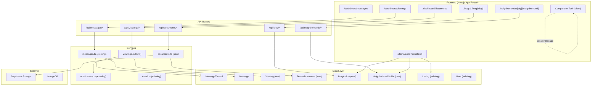

# Design Document: Competitive Feature Parity

## Overview

This design covers 8 features that close competitive gaps against HousingAnywhere, Spotahome, and Uniplaces. The features span frontend UI (Messages Dashboard, Comparison Tool), backend services (Viewing Scheduler, Document Upload), content systems (Neighborhood Guides, Blog), SEO infrastructure, and i18n completion.

All features build on the existing Next.js 15 App Router architecture with MongoDB/Mongoose, Supabase Auth + Storage, and next-intl. The design prioritizes reuse of existing services (messages, notifications, email, session) and models (Listing, User, SiteContent, MessageThread, Message).

### Key Design Decisions

1. **Viewing Scheduler** uses a new `Viewing` Mongoose model rather than extending MessageThread, keeping scheduling concerns separate from messaging.
2. **Document Upload** uses a new Supabase Storage bucket (`tenant-documents`) with signed URLs for time-limited sharing, plus a `TenantDocument` Mongoose model for metadata.
3. **Listing Comparison** is entirely client-side using sessionStorage — no new backend needed.
4. **Blog/News** extends the existing `SiteContent` model pattern with a new `BlogArticle` model rather than overloading SiteContent, since articles have distinct fields (slug, category, author, featured image, draft status).
5. **Neighborhood Guides** use a `NeighborhoodGuide` model with admin CMS editing via the existing admin content pattern.
6. **SEO** uses Next.js App Router conventions (`sitemap.ts`, `robots.ts`, `generateMetadata`) — no external SEO libraries needed.
7. **Multi-language** wires existing `next-intl` infrastructure into all new and existing components by expanding message JSON files.

## Architecture




## Components and Interfaces

### 1. Messages Dashboard Page

**Route:** `src/app/dashboard/messages/page.tsx` (client component)

**Components:**
- `ThreadList` — displays threads sorted by `lastMessageAt` desc, shows listing title, other participant name, unread badge
- `MessageView` — displays messages in chronological order for selected thread, with send form at bottom
- `EmptyState` — shown when user has no threads

**API consumption:** Uses existing endpoints:
- `GET /api/messages/threads` — fetch user's threads
- `GET /api/messages/threads/[threadId]` — fetch messages for a thread
- `POST /api/messages` — send a message (body: `{ listingId, body }`)

**Unread tracking:** Add an `isRead` map to `MessageThread` model keyed by participant ID, updated when messages are fetched. The thread list component checks this to show badges.

**Auth guard:** Uses `requireSessionUser` on API side; client redirects to `/login` if session fetch returns 401.

### 2. Viewing Scheduler

**Routes:**
- `src/app/api/viewings/route.ts` — POST (create request), GET (list for user)
- `src/app/api/viewings/[id]/confirm/route.ts` — PATCH (poster confirms)
- `src/app/api/viewings/[id]/decline/route.ts` — PATCH (poster declines)
- `src/app/dashboard/viewings/page.tsx` — dashboard UI for managing viewings

**Service:** `src/lib/services/viewings.ts`
- `requestViewing(seekerId, listingId, proposedDate)` — validates date is future, checks no duplicate pending request, creates Viewing doc, sends notification to poster
- `confirmViewing(viewingId, posterId)` — validates poster owns listing, updates status to "confirmed", notifies seeker
- `declineViewing(viewingId, posterId, reason?)` — updates status to "declined", notifies seeker with optional reason
- `getViewingsForUser(userId)` — returns viewings where user is seeker or poster
- `completeExpiredViewings()` — cron-callable function that marks confirmed viewings with past dates as "completed"

**Listing detail integration:** Add "Request Viewing" button to `src/app/listings/[id]/page.tsx` for authenticated seekers.

### 3. Document Upload for Tenants

**Routes:**
- `src/app/api/documents/route.ts` — POST (upload), GET (list user's docs)
- `src/app/api/documents/[id]/route.ts` — DELETE (remove doc)
- `src/app/api/documents/[id]/share/route.ts` — POST (generate time-limited URL)
- `src/app/dashboard/documents/page.tsx` — "My Documents" UI

**Service:** `src/lib/services/documents.ts`
- `uploadDocument(userId, file, documentType)` — validates file type (PDF/JPG/PNG) and size (≤10MB), uploads to Supabase Storage `tenant-documents` bucket, creates TenantDocument metadata record
- `listDocuments(userId)` — returns all docs for user
- `deleteDocument(documentId, userId)` — removes from storage and deletes metadata
- `generateShareUrl(documentId, userId)` — creates signed URL valid for 7 days

**Supabase Storage:** New bucket `tenant-documents` with path pattern `{userId}/{documentId}.{ext}`.

### 4. Listing Comparison Tool

**Components (client-side only):**
- `CompareButton` — "Add to Compare" button rendered on search results and listing detail pages
- `CompareBar` — floating bottom bar showing selected listings (2-3) with "Compare" action
- `ComparisonView` — full-page or modal side-by-side layout at `/compare`
- `ComparisonCard` — mobile-friendly scrollable card variant

**State management:** Uses `sessionStorage` to persist comparison selection across page navigations. Stores array of listing IDs (max 3). Listing data fetched from existing `GET /api/listings/[id]` when comparison view opens.

**Diff highlighting:** Fields with differing values across compared listings get a CSS highlight class.

### 5. SEO and Sitemap

**Files:**
- `src/app/sitemap.ts` — Next.js dynamic sitemap generation. Queries active listings, published blog articles, and neighborhood guides. Splits into sitemap index if >50,000 URLs.
- `src/app/robots.ts` — serves `robots.txt` allowing all crawlers, referencing sitemap URL
- Listing detail `generateMetadata` — adds JSON-LD (`RentalListing`), Open Graph, Twitter Card meta tags
- Blog article `generateMetadata` — adds JSON-LD (`Article`), OG, Twitter Card
- Per-page `<title>` and `<meta description>` using listing title, city, price

**JSON-LD:** Rendered as `<script type="application/ld+json">` in page head via Next.js metadata API.

### 6. Multi-language UI Integration

**Approach:** Expand all 6 message JSON files (`messages/{en,es,fr,de,pt,it}.json`) with keys for every UI string. Wire `useTranslations()` in client components and `getTranslations()` in server components.

**Scope:** Navigation, forms, buttons, error messages, empty states, footer, dashboard labels, new feature UIs (messages, viewings, documents, comparison, blog, neighborhoods).

**Date/number/currency formatting:** Use `useFormatter()` from next-intl for locale-aware formatting.

**Fallback:** next-intl already falls back to `en` when a key is missing in a locale file (configured in `src/i18n/request.ts`).

### 7. Neighborhood Guides

**Routes:**
- `src/app/neighborhoods/[city]/[neighborhood]/page.tsx` — public guide page
- `src/app/api/neighborhoods/route.ts` — GET (list guides), POST (admin create)
- `src/app/api/neighborhoods/[id]/route.ts` — GET, PUT (admin edit), DELETE

**Sections:** Overview, transit score + nearby transport, safety info, amenities (supermarkets, pharmacies, schools, parks), average rent, map (Leaflet), active listings in area.

**Listing integration:** On listing detail page, if `address.neighborhood` is set, show link to the corresponding guide.

**Admin CMS:** New section in admin panel (`src/app/admin/neighborhoods/page.tsx`) using the same editing pattern as `src/app/admin/content/page.tsx`.

### 8. Blog/News Section

**Routes:**
- `src/app/blog/page.tsx` — paginated article list with category filter tabs
- `src/app/blog/[slug]/page.tsx` — full article view with related articles sidebar
- `src/app/api/blog/route.ts` — GET (list published), POST (admin create)
- `src/app/api/blog/[slug]/route.ts` — GET (single article), PUT (admin edit)
- `src/app/admin/blog/page.tsx` — admin article management

**Categories:** `moving_guides`, `city_guides`, `rental_tips`, `expat_life`

**Draft support:** Articles have `isPublished` boolean. Unpublished articles are only visible in admin panel.

**Related articles:** Query by same category, exclude current article, limit 3.


## Data Models

### Viewing (new)

```typescript
// src/lib/db/models/Viewing.ts
interface IViewing extends Document {
  listingId: Types.ObjectId;    // ref: Listing
  seekerId: Types.ObjectId;     // ref: User (requester)
  posterId: Types.ObjectId;     // ref: User (listing owner)
  proposedDate: Date;           // must be in the future at creation
  status: "pending" | "confirmed" | "declined" | "completed";
  declineReason?: string;
  createdAt: Date;
  updatedAt: Date;
}
// Indexes: { listingId: 1, seekerId: 1, status: 1 }, { posterId: 1, status: 1 }, { status: 1, proposedDate: 1 }
```

### TenantDocument (new)

```typescript
// src/lib/db/models/TenantDocument.ts
type DocumentType = "proof_of_income" | "employment_letter" | "reference_letter" | "identity_document" | "bank_statement";

interface ITenantDocument extends Document {
  userId: Types.ObjectId;       // ref: User
  documentType: DocumentType;
  fileName: string;
  fileSize: number;             // bytes
  mimeType: string;             // "application/pdf" | "image/jpeg" | "image/png"
  storagePath: string;          // Supabase Storage path
  createdAt: Date;
}
// Indexes: { userId: 1, documentType: 1 }
```

### BlogArticle (new)

```typescript
// src/lib/db/models/BlogArticle.ts
type BlogCategory = "moving_guides" | "city_guides" | "rental_tips" | "expat_life";

interface IBlogArticle extends Document {
  title: string;
  slug: string;                 // unique, URL-safe
  body: string;                 // HTML content
  category: BlogCategory;
  authorId: Types.ObjectId;     // ref: User (admin)
  featuredImageUrl?: string;
  isPublished: boolean;
  publishedAt?: Date;
  createdAt: Date;
  updatedAt: Date;
}
// Indexes: { slug: 1 } (unique), { isPublished: 1, publishedAt: -1 }, { category: 1, isPublished: 1 }
```

### NeighborhoodGuide (new)

```typescript
// src/lib/db/models/NeighborhoodGuide.ts
interface INeighborhoodGuide extends Document {
  city: string;
  neighborhood: string;
  slug: string;                 // unique, e.g. "berlin-kreuzberg"
  overview: string;             // HTML
  transitScore?: number;        // 0-100
  transitInfo?: string;         // HTML
  safetyInfo?: string;          // HTML
  amenities?: {
    supermarkets: string[];
    pharmacies: string[];
    schools: string[];
    parks: string[];
  };
  averageRent?: number;         // EUR
  centerLat: number;
  centerLng: number;
  isPublished: boolean;
  updatedBy: Types.ObjectId;    // ref: User (admin)
  createdAt: Date;
  updatedAt: Date;
}
// Indexes: { slug: 1 } (unique), { city: 1, neighborhood: 1 } (unique), { isPublished: 1 }
```

### MessageThread (existing — extended)

Add `readBy` field to track which participants have read the latest messages:

```typescript
// Addition to existing IMessageThread
readBy: Map<string, Date>;  // participantId -> last read timestamp
```

### Comparison Tool (no model)

Uses `sessionStorage` only. Stores `compare_listing_ids: string[]` (max 3 IDs).

