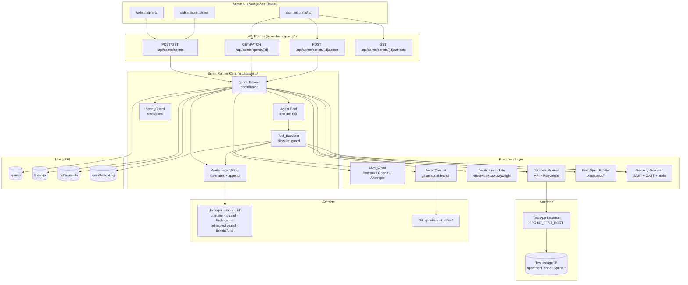

# Design Document: Virtual Team Sprint Runner

## Overview

The Virtual Team Sprint Runner is an orchestration subsystem embedded inside the existing Apartment Finder Next.js 15 webapp. It simulates a cross-functional software team — developers, tech lead, QA, security, UX, PM, DevOps, and accessibility specialist — running time-boxed sprints against an isolated test instance of the App. Each sprint drives simulated customer personas through API calls and Playwright, collects structured findings, synthesizes fixes in a shared markdown workspace, runs the full verification gate, and auto-commits passing changes to a sprint branch. Larger initiatives are emitted as new `.kiro/specs/` documents for human review.

The system is operated from `/admin/sprints/*`, gated by the existing `requireAdmin()` session guard. Agents are backed by a pluggable LLM provider layer (Bedrock / OpenAI / Anthropic) but all side-effects — file I/O, git, test runs, Playwright, shell — are performed by a deterministic execution layer that restricts LLM output to a defined tool interface. The LLM never touches the repository directly.

### Design Principles

1. **Deterministic execution, probabilistic reasoning**: LLMs reason and propose; a deterministic executor validates and acts. All tool calls pass through an allow-list check.
2. **Markdown-as-message-bus**: Agents communicate through append-only shared markdown files under `.kiro/sprints/<sprint_id>/`. A file-level mutex serializes appends. This keeps the "conversation" auditable and re-playable.
3. **Branch isolation**: All auto-commits land on `sprint/<sprint_id>/fix-<fix_id>` branches. The user's currently checked-out branch is never modified and nothing is ever pushed.
4. **Verification-gated commits**: No fix commits without `vitest --run`, `next lint`, `tsc --noEmit`, and (conditionally) Playwright all passing. Timeouts and retry caps are enforced.
5. **Route-by-size to specs**: Any fix touching >10 files, >500 changed lines, or including a critical security finding is promoted to a new `.kiro/specs/` directory rather than auto-committed.
6. **Reuse, don't recreate**: The design reuses `dbConnect`, `requireAdmin`, the existing rate-limit and session patterns, the existing markdown spec format, and the MongoDB collection conventions already in place.

## Architecture

The Sprint Runner lives in `src/lib/sprint/` as a set of services composed together by the `Sprint_Runner` coordinator. The admin UI consumes a new set of API routes under `/api/admin/sprints/*`. Agents run as in-process async workers scheduled by the coordinator — no background process manager is introduced for the first version.



### Key Architectural Choices

1. **In-process agents, no worker process manager.** Sprints run inside the main Next.js server process as long-lived async tasks, keyed by `sprintId`. A single-running-sprint invariant (Requirement 12.6) keeps this simple. The coordinator holds in-memory state keyed by `sprintId` and rehydrates from MongoDB on server restart by inspecting sprints in `running` or `closing` state (forcibly aborting them with reason `process_restart`).

2. **LLM output is never trusted directly.** Every Agent call returns a JSON object that is parsed and validated against a Zod schema describing `{ tool, parameters }`. The `Tool_Executor` then consults the Agent's allow-list manifest (`src/lib/sprint/tools/<role>.json`) before executing. Unknown tools, malformed JSON, or disallowed tools produce a logged rejection and a corrective prompt back to the Agent.

3. **File mutex, not database locks.** Shared docs are append-only markdown files in the working tree. Appends are serialized through a per-file `async-mutex` lock keyed by absolute path. The lock lives in the Node.js process; because only one sprint runs at a time, this is sufficient.

4. **Isolated test app instance as a child process.** `Sprint_Runner` spawns `npm run start` (or `next start`) on `SPRINT_TEST_PORT` with `MONGODB_URI` pointed at a dedicated database `apartment_finder_sprint_<sprint_id>` and environment loaded from `.env.sprint`. The child process is terminated on sprint completion, abort, or timeout. The production connection pool is never reused.

5. **Git operations through `simple-git`, not shell strings.** All git operations run via the `simple-git` library against the workspace root. The runner enforces: no `push`, no `--force`, no `checkout` of any branch other than a `sprint/*` branch, and a pre-flight guard that records the user's current branch and refuses to proceed if a checkout would change it.

6. **PBT for the rule layer, integration tests for the orchestration.** The core invariants (verification-gated commits, single-running-sprint, append-only docs, tool allow-list, no-push, spec-emission trigger) are expressed as property-based tests against pure rule functions. The orchestration itself (spawning child processes, running Playwright) uses a small number of integration tests.

## Components and Interfaces

### Sprint_Runner (`src/lib/sprint/runner.ts`)

The coordinator. Holds in-memory state per running sprint, drives the state machine, dispatches work to agents, and owns the references to the child test instance process. Public API:

```typescript
interface CreateSprintInput {
  roles: AgentRole[];           // must include "tech_lead"
  personas: CustomerPersona[];
  durationMinutes: number;      // 5..240
  goals: string[];              // free-form, non-empty
  createdBy: string;            // admin user id
}

interface SprintRunner {
  create(input: CreateSprintInput): Promise<Sprint>;       // -> status: "pending"
  start(sprintId: string): Promise<void>;                  // pending -> running
  abort(sprintId: string, reason: string): Promise<void>;  // running -> aborted
  getStatus(sprintId: string): Promise<SprintStatusView>;  // for polling UI
  // Internal coordinator loop (not exposed via API):
  tick(sprintId: string): Promise<void>;                   // scheduler heartbeat
}
```

### Agent_Pool (`src/lib/sprint/agents/pool.ts`)

Instantiates one `Agent` per selected role, loads the role prompt from `src/lib/sprint/prompts/<role>.md`, and the allowed-tool manifest from `src/lib/sprint/tools/<role>.json`. Agents are identified by `{ sprintId, role }`. Each `Agent.step()` call issues one LLM request, parses the response, and returns a parsed `ToolCall` or a `NoOp`.

```typescript
type AgentRole =
  | "tech_lead" | "senior_dev" | "frontend_dev" | "backend_dev"
  | "qa_engineer" | "security_engineer" | "ux_designer"
  | "product_manager" | "devops_engineer" | "accessibility_specialist";

interface Agent {
  role: AgentRole;
  sprintId: string;
  step(context: AgentContext): Promise<ToolCall | { kind: "noop" }>;
}

interface AgentContext {
  planMd: string;
  recentLogEntries: string[];    // last N log entries visible to this role
  assignedTickets: string[];     // ticket ids currently owned by this role
  tokenBudgetRemaining: number;
}
```

### Tool_Executor (`src/lib/sprint/tools/executor.ts`)

The guard that sits between agents and side-effects. It (a) validates that the requested tool is in the agent's allow-list, (b) validates the tool parameters against the tool's Zod schema, (c) logs a `sprintActionLog` entry, then (d) invokes the tool implementation. If any step fails, it logs a rejection and returns a structured error to the agent — side-effects are skipped.

```typescript
interface ToolCall {
  kind: "tool_call";
  tool: string;                 // e.g. "workspace.append"
  parameters: unknown;          // validated by the tool's schema
}

interface ToolResult {
  ok: boolean;
  output?: unknown;
  errorCode?: "UNKNOWN_TOOL" | "NOT_ALLOWED" | "INVALID_PARAMS" | "EXECUTION_ERROR";
  errorMessage?: string;
}

interface ToolExecutor {
  execute(
    agent: { role: AgentRole; sprintId: string },
    call: ToolCall,
  ): Promise<ToolResult>;
}
```

### Agent Tool Interface and Allowed-Tool Manifest

All available tools (exactly one implementation each, in `src/lib/sprint/tools/impl/*.ts`):

| Tool name | Purpose | Who can call (default) |
|---|---|---|
| `workspace.read` | Read a shared doc or ticket file | all roles |
| `workspace.append` | Append a block to a shared doc | all roles |
| `workspace.create_ticket` | Create `.kiro/sprints/<id>/tickets/<ticket>.md` | tech_lead, any_dev |
| `findings.emit` | Emit a validated Finding record | all roles |
| `fix.propose` | Submit a Fix_Proposal (file diffs + test plan) | tech_lead, *_dev |
| `fix.verify` | Run Verification_Gate on a Fix_Proposal | tech_lead |
| `fix.commit` | After `passed` status, request Auto_Commit | tech_lead |
| `journey.run` | Trigger a Journey_Runner job for a persona | qa_engineer, product_manager |
| `security.scan_sast` | Run SAST scan over `src/` | security_engineer |
| `security.scan_secrets` | Run secret regex scan | security_engineer |
| `security.audit_deps` | Run `npm audit --json` | security_engineer |
| `security.review_diff` | Review a `passed` Fix_Proposal diff | security_engineer |
| `a11y.run_axe` | Run axe-core against a list of URLs | accessibility_specialist |
| `lighthouse.run` | Run Lighthouse JSON output against test URL | devops_engineer, tech_lead |
| `llm.think` | Structured reasoning with no side-effects (writes only to ephemeral scratchpad) | all roles |

Manifest files (`src/lib/sprint/tools/<role>.json`) list the allowed tools per role. Example for `security_engineer`:

```json
{
  "role": "security_engineer",
  "allowedTools": [
    "workspace.read", "workspace.append", "findings.emit",
    "security.scan_sast", "security.scan_secrets", "security.audit_deps",
    "security.review_diff", "journey.run", "llm.think"
  ]
}
```

The manifest is **loaded at sprint start and frozen in memory for the sprint's lifetime** so a modified manifest cannot expand a running agent's powers mid-sprint.

### Workspace_Writer (`src/lib/sprint/workspace.ts`)

Owns the shared markdown workspace at `.kiro/sprints/<sprint_id>/`. Provides `init()`, `read(path)`, and `append(path, block)`. The writer:

- Uses a per-absolute-path async mutex; concurrent appends are serialized.
- Enforces a 2 MB per-file limit; when exceeded, subsequent appends go to `<filename>.part<N>.md`.
- Rejects any write operation that is not an append or a new-file create under the workspace root.
- Computes and stores a running SHA-256 content hash per file after each append for monotonicity verification.
- Every successful append also appends a matching entry to `log.md` (tool, role, timestamp, doc path).

### Journey_Runner (`src/lib/sprint/journey/runner.ts`)

Drives a `Customer_Persona` through a declarative list of `JourneyStep`s. A step is either `api` (direct HTTP call to the test instance) or `browser` (Playwright). The runner is a pure state machine; it emits `Finding`s on assertion failure via `findings.emit`.

```typescript
type JourneyMode = "api" | "browser";

interface JourneyStep {
  id: string;
  mode: JourneyMode;
  description: string;
  // For api mode:
  request?: { method: string; path: string; body?: unknown; headers?: Record<string, string> };
  expect?: { status?: number; jsonPath?: Record<string, unknown> };
  // For browser mode:
  playwright?: {
    actions: PlaywrightAction[];     // click, fill, goto, assertVisible, ...
    axeCheck?: boolean;              // run axe-core at this step
  };
  severity: "low" | "medium" | "high" | "critical";
}

interface Journey {
  id: string;
  persona: CustomerPersona;
  critical: boolean;                // -> forces browser mode per Requirement 4.4
  bulk: boolean;                    // -> forces api mode per Requirement 4.5
  steps: JourneyStep[];
}

interface JourneyRunner {
  run(journey: Journey, ctx: JourneyContext): Promise<JourneyResult>;
}

interface JourneyContext {
  baseUrl: string;                  // http://localhost:${SPRINT_TEST_PORT}
  locale: string;                   // non-English for non_english_speaker
  network?: { downKbps: number; rttMs: number };  // mobile_slow_network
  playwright?: import("playwright").BrowserContext;
}

interface JourneyResult {
  journeyId: string;
  status: "completed" | "failed" | "incomplete";
  findings: Finding[];
  stepResults: Array<{ stepId: string; status: "pass" | "fail" | "skip"; evidence?: string }>;
}
```

Dispatch rules:
- `critical: true` → always browser mode; non-browser steps inside a critical journey are promoted to browser equivalents.
- `bulk: true` → always api mode; browser-only steps are skipped with a `skip` result.
- Neither set → mode taken from each step, defaulting to `api`.
- `mobile_slow_network` persona wraps the Playwright context in a CDP route that throttles to 400 kbps / 100 ms RTT.
- `screen_reader_user` persona forces `axeCheck: true` on every `browser` step and emits one Finding per WCAG 2.1 AA violation.
- `adversarial_probe` persona runs the DAST probe set from `src/lib/sprint/security/dast-probes.json` and is the only persona permitted to probe state-changing endpoints; it is hard-restricted to `localhost` and `process.env.SPRINT_TEST_BASE_URL`.

Findings emitted by a journey are routed through the same `findings.emit` tool call used by agents, so the validation, dedup, and audit-logging rules apply uniformly.

### Verification_Gate (`src/lib/sprint/verify.ts`)

A pure pipeline. Input: a `FixProposal` with `fileChanges` already applied to the sprint branch. Output: a `VerificationReport`.

```typescript
interface VerificationStep {
  name: "vitest" | "next-lint" | "tsc" | "playwright";
  status: "pass" | "fail" | "skipped" | "timeout";
  durationMs: number;
  output: string;                   // captured stdout+stderr, truncated
}

interface VerificationReport {
  fixProposalId: string;
  overall: "passed" | "failed";
  steps: VerificationStep[];
  startedAt: Date;
  completedAt: Date;
}
```

Pipeline:

1. `vitest --run` with `--reporter=json` and a 300 s timeout.
2. `next lint` with a 180 s timeout.
3. `tsc --noEmit` with a 180 s timeout.
4. If `shouldRunPlaywright(fixProposal.findingIds)` → Playwright critical-flow suite with a 420 s timeout (only runs when any linked Finding has category `accessibility`, `ux`, or `i18n`).

Global wall-clock cap: **10 minutes** per Verification_Gate invocation (Requirement 6.11). Exceeding it marks every not-yet-run step as `timeout` and sets `overall = "failed"`.

Retry semantics: the *Sprint_Runner* retries `fix.verify` up to 3 times per `fixProposalId`. The gate itself never retries internally. A 4th failure marks the proposal `rejected` (Requirement 6.10).

### Auto_Commit (`src/lib/sprint/git.ts`)

Wraps `simple-git` with a fixed, narrow API. Every method enforces:

- The working tree's originally-checked-out branch name is captured at sprint start; any operation that would check out a non-`sprint/*` branch or that would leave HEAD on the original branch with uncommitted fix changes is rejected.
- `push`, `push --force`, `remote add`, `remote set-url` are not exposed and attempts to call them through the raw API are intercepted.
- Fix commits land on `sprint/<sprintId>/fix-<fixProposalId>`. The runner creates the branch from the original HEAD on first commit for a given fix.

```typescript
interface SprintGit {
  createFixBranch(sprintId: string, fixProposalId: string): Promise<string>; // returns branch name
  applyFileChanges(branch: string, changes: FileChange[]): Promise<void>;
  commitFix(branch: string, fix: FixProposal): Promise<string>; // returns commit SHA
  mergeToMainline(branch: string, strategy: "ff" | "squash"): Promise<string>;
  revert(branch: string, sha: string): Promise<string>;
  // Guardrails — called before any mutating op:
  assertOnSprintBranch(branch: string): Promise<void>;
  assertNoRemotePushAttempted(): Promise<void>;
}
```

Branch naming: `sprint/<sprintId>/fix-<fixProposalId>`. `sprintId` is the 24-char Mongo ObjectId; `fixProposalId` is the sequential fix id shown to agents (e.g. `P-abc123-7`).

Commit message format (conventional commits):

```
fix(sprint): <finding titles, truncated 72 chars>

Fix-Proposal: <fixProposalId>
Finding-Ids: <comma-separated F-ids>
Sprint-Id: <sprintId>
Verified: vitest=pass next-lint=pass tsc=pass playwright=<pass|skipped>
```

### Kiro_Spec_Emitter (`src/lib/sprint/spec-emitter.ts`)

Triggered when `shouldPromoteToSpec(fixProposal, findings)` returns true. Trigger conditions (Requirement 11):

```typescript
function shouldPromoteToSpec(fp: FixProposal, findings: Finding[]): boolean {
  const fileCount = fp.fileChanges.length;
  const lineCount = fp.fileChanges.reduce((n, c) => n + c.addedLines + c.removedLines, 0);
  const linkedFindings = findings.filter(f => fp.findingIds.includes(f.id));
  const hasCriticalSecurity = linkedFindings.some(
    f => f.category === "security" && f.severity === "critical"
  );
  return fileCount > 10 || lineCount > 500 || hasCriticalSecurity;
}
```

On trigger, the emitter:

1. Derives a kebab-case name from `fp.title`; appends `-2`, `-3`, ... if `.kiro/specs/<name>/` already exists.
2. Creates the directory and writes four files from templates under `src/lib/sprint/templates/spec/`:
    - `.config.kiro` — `{"specId": <uuid>, "workflowType": "requirements-first", "specType": "feature"}`
    - `requirements.md` — header + introduction + one Requirement per linked Finding, rendered from the Finding's title, description, and reproduction steps.
    - `design.md` — skeleton sections only (Overview, Architecture, Components and Interfaces, Data Models, Error Handling, Testing Strategy). Marked as "DRAFT – emitted by sprint <sprintId>".
    - `tasks.md` — skeleton checklist with one top-level task per Requirement.
3. Sets `fp.status = "promoted_to_spec"` and `fp.promotedSpecPath = ".kiro/specs/<name>"`.
4. Appends a "Promoted Initiatives" link to `retrospective.md`.

No git commit is made by the emitter; the generated spec files are left on the user's current working branch as untracked files for the admin to review.

### Admin UI Component Tree (`src/app/admin/sprints/`)

```
src/app/admin/sprints/
├── layout.tsx                      # requireAdmin guard at the layout level
├── page.tsx                        # sprint list
├── new/page.tsx                    # sprint creation form (client component)
└── [id]/
    ├── page.tsx                    # detail shell with tabs
    ├── overview-tab.tsx            # metadata, live status, elapsed time
    ├── workspace-tab.tsx           # renders each Shared_Doc as markdown
    ├── findings-tab.tsx            # filterable list with severity chips
    ├── fix-proposals-tab.tsx       # list + per-fix drawer with diff + actions
    ├── retrospective-tab.tsx       # rendered retrospective.md
    └── action-log-tab.tsx          # sprintActionLog entries + JSON export
```

The detail page uses client-side polling via `useSWR` with `refreshInterval: 5000` while the sprint is `running` or `closing`; it switches to static fetch once `completed` or `aborted`. Polling hits `GET /api/admin/sprints/[id]` which returns a `SprintStatusView` aggregate (sprint record + counts + last-N log entries).

All `/admin/sprints/*` routes are gated by `requireAdmin()` from `src/lib/api/session.ts`; a non-admin request returns 403 via `ApiErrorResponse`.

## Data Models

### TypeScript Interfaces and Mongoose Shapes

All models follow existing repo conventions (`Types.ObjectId`, explicit `createdAt`/`updatedAt`, compound indexes declared in the schema).

#### Sprint (`src/lib/db/models/Sprint.ts`)

```typescript
type SprintStatus = "pending" | "running" | "closing" | "completed" | "aborted";
type SprintResult = "met_success_bar" | "below_success_bar" | undefined;

interface ISprint {
  _id: Types.ObjectId;
  status: SprintStatus;
  result?: SprintResult;
  goals: string[];
  durationMinutes: number;           // 5..240
  roles: AgentRole[];                // must include "tech_lead"
  personas: CustomerPersona[];
  agents: AgentInstance[];           // one per selected role, frozen at start
  createdBy: Types.ObjectId;         // admin user id
  testDbName: string;                // apartment_finder_sprint_<id>
  testPort: number;
  tokenBudget: number;
  tokensUsed: number;
  hasCriticalFinding: boolean;
  currentBranchAtStart: string;      // user's branch name, captured at start
  startedAt?: Date;
  closingAt?: Date;
  completedAt?: Date;
  abortedAt?: Date;
  abortReason?: string;
  createdAt: Date;
  updatedAt: Date;
}
// Indexes: { status: 1, createdAt: -1 }, { createdBy: 1, createdAt: -1 }
// Partial unique index: { status: 1 } where status = "running" (enforces single-runner invariant)
```

#### AgentInstance (embedded in Sprint)

```typescript
interface AgentInstance {
  role: AgentRole;
  provider: "bedrock" | "openai" | "anthropic";
  model: string;                     // e.g. "anthropic.claude-3-5-sonnet-20241022-v2:0"
  allowedTools: string[];            // frozen copy of manifest at sprint start
  tokensUsed: number;
}
```

#### Finding (`src/lib/db/models/Finding.ts`)

```typescript
type FindingCategory = "ux" | "security" | "performance" | "accessibility" | "bug" | "i18n" | "seo";
type FindingSeverity = "low" | "medium" | "high" | "critical";

interface IFinding {
  _id: Types.ObjectId;
  id: string;                        // F-<sprint_short>-<sequence>, unique
  sprintId: Types.ObjectId;
  reporterAgentRole?: AgentRole;
  reporterPersona?: CustomerPersona;
  category: FindingCategory;
  severity: FindingSeverity;
  title: string;
  description: string;
  reproductionSteps: string[];
  evidenceUrls: string[];
  dedupSignature: string;            // sha256(category|title|joined repro steps)
  duplicateCount: number;            // bumped when a later dup is suppressed
  createdAt: Date;
}
// Indexes: { sprintId: 1, createdAt: 1 }, { sprintId: 1, severity: 1, category: 1 }
// Unique compound: { sprintId: 1, dedupSignature: 1 }
```

#### FixProposal (`src/lib/db/models/FixProposal.ts`)

```typescript
type FixStatus =
  | "draft" | "verifying" | "passed" | "failed"
  | "committed" | "rejected" | "promoted_to_spec" | "reverted";

interface FileChange {
  path: string;                      // repo-relative
  operation: "create" | "modify" | "delete";
  addedLines: number;
  removedLines: number;
  diff: string;                      // unified diff
}

interface IFixProposal {
  _id: Types.ObjectId;
  id: string;                        // P-<sprint_short>-<sequence>, unique per sprint
  sprintId: Types.ObjectId;
  findingIds: string[];              // Finding.id values (F-*)
  authorAgentRole: AgentRole;
  title: string;
  fileChanges: FileChange[];
  testPlan: string;
  status: FixStatus;
  rejectReason?: "verification_failed" | "security_review_blocked" | "timeout" | "verify_attempts_exhausted";
  promotedSpecPath?: string;
  commitSha?: string;                // set when status = "committed"
  branch?: string;                   // sprint/<sprintId>/fix-<id>
  verificationAttempts: number;
  lastVerificationReport?: VerificationReport;
  createdAt: Date;
  updatedAt: Date;
}
// Indexes: { sprintId: 1, status: 1, createdAt: 1 }, { sprintId: 1, id: 1 } unique
```

#### SprintActionLog (`src/lib/db/models/SprintActionLog.ts`)

```typescript
interface ISprintActionLog {
  _id: Types.ObjectId;
  sprintId: Types.ObjectId;
  timestamp: Date;
  agentRole: AgentRole;
  toolName: string;
  parameterDigest: string;           // sha256 of JSON.stringify(params)
  outcome: "ok" | "rejected_unknown_tool" | "rejected_not_allowed" | "rejected_invalid_params" | "execution_error";
  errorMessage?: string;             // truncated, no raw secrets
  rawParameters?: unknown;           // only set when SPRINT_VERBOSE_LOGS=true
  rawResponse?: unknown;             // only set when SPRINT_VERBOSE_LOGS=true
}
// Indexes: { sprintId: 1, timestamp: 1 }, { sprintId: 1, agentRole: 1, timestamp: 1 }
```

### Sprint State Machine

```mermaid
stateDiagram-v2
    [*] --> pending: create()
    pending --> running: start() [no other running sprint; .env.sprint valid]
    pending --> aborted: abort()
    running --> closing: duration elapsed OR token budget exhausted
    running --> aborted: admin abort() OR 150% duration timeout OR process_restart
    closing --> completed: all agents finished closing work + retrospective written
    closing --> aborted: admin abort() during closing
    completed --> [*]
    aborted --> [*]
```



Transition guards (implemented in `src/lib/sprint/state-guard.ts`, the single source of truth for transition legality):

| From | To | Guard |
|---|---|---|
| `pending` | `running` | (a) `agents` includes `tech_lead`; (b) no sprint exists with status `running`; (c) `.env.sprint` loaded and required keys present; (d) test port reachable & test DB creatable |
| `pending` | `aborted` | always |
| `running` | `closing` | elapsed ≥ `durationMinutes` OR `tokensUsed ≥ tokenBudget` |
| `running` | `aborted` | admin requested OR elapsed ≥ 1.5 × `durationMinutes` (reason=`timeout`) OR process restart detected (reason=`process_restart`) |
| `closing` | `completed` | retrospective.md exists AND every agent has no pending work items |
| `closing` | `aborted` | admin requested |
| any terminal | * | rejected |

The state guard is a pure function `nextState(sprint, event): { ok, next } | { ok:false, code }` — this is the seam exercised by property tests.

## Correctness Properties


*A property is a characteristic or behavior that should hold true across all valid executions of a system — essentially, a formal statement about what the system should do. Properties serve as the bridge between human-readable specifications and machine-verifiable correctness guarantees.*

The Sprint Runner is well-suited to property-based testing in its rule layer: the state guard, the tool executor, the verification-pipeline mapper, the dedup logic, the spec-emission trigger, the workspace writer, and the git-safety wrapper are all pure or near-pure functions whose inputs can be generated with fast-check. Orchestration concerns (spawning test instances, running real Playwright, calling real LLMs) are covered by a small set of integration tests instead.

### Property 1: Sprint state transitions are correct and terminal states are absorbing

*For any* Sprint record and any transition event, the state guard returns the expected next state when the event is legal (per the transition table in the state-machine diagram) and rejects with a structured error code when the event is illegal or a guard condition is unmet; terminal states (`completed`, `aborted`) never transition to any other state regardless of event.

**Validates: Requirements 1.3, 1.5, 1.6, 1.7, 1.8, 6.10, 8.7, 12.3**

### Property 2: At most one sprint is in status `running` at any time

*For any* sequence of `create`, `start`, and `abort` operations interleaved across arbitrary admin sessions, the number of Sprint records with `status = "running"` in the `sprints` collection after each operation is at most 1, and any second concurrent `start` call is rejected with a 409 response without side-effects.

**Validates: Requirements 12.6, 1.3**

### Property 3: Shared docs are append-only (content hash monotonicity)

*For any* Sprint_Workspace and any sequence of workspace operations (appends, part rotations, ticket creations), every earlier snapshot of a Shared_Doc is a byte-prefix of every later snapshot of the same logical doc (counting `.part<N>.md` files as an ordered continuation), and the SHA-256 content hash of the concatenation never decreases monotonically nor changes retroactively for already-written bytes.

**Validates: Requirements 3.6, 3.7, 3.8**

### Property 4: Appends are serialized under a file mutex

*For any* set of N concurrent `workspace.append` calls against the same Shared_Doc, after all calls resolve the doc contains exactly N appended blocks (no interleaved bytes, no lost writes), `log.md` contains exactly N matching log entries, and each block appears intact with its original content.

**Validates: Requirements 3.5, 3.8**

### Property 5: Journey dispatch mode follows persona flags

*For any* `Journey`, the Journey_Runner dispatches every step in `browser` mode when `journey.critical` is true, dispatches every step in `api` mode when `journey.bulk` is true, and otherwise uses the step's declared mode; and no combination of `critical` and `bulk` is executed (inputs with both set are rejected at validation).

**Validates: Requirements 4.4, 4.5**

### Property 6: Tool_Executor enforces the per-role allow-list and writes exactly one audit entry per call

*For any* agent role `r` and any tool call `{tool, parameters}`, the executor's outcome is `ok` if and only if `tool` is in the frozen `allowedTools` manifest for `r` and the parameters validate against the tool's schema; every invocation — whether `ok` or rejected — produces exactly one `sprintActionLog` entry containing `{timestamp, sprintId, agentRole, toolName, parameterDigest, outcome}` with `parameterDigest = sha256(JSON.stringify(parameters))`.

**Validates: Requirements 13.2, 13.3**

### Property 7: Outbound hosts from personas and agents are allow-listed

*For any* `journey.run` initiated by the `adversarial_probe` persona and any network call initiated by the `security_engineer` agent, the destination host is either `localhost` (any port) or the host component of `process.env.SPRINT_TEST_BASE_URL`; a request to any other host is rejected before transmission and logged as `rejected_not_allowed`.

**Validates: Requirements 4.11, 7.7**

### Property 8: Finding emission produces unique ids, deduplicates, and rejects invalid records

*For any* sequence of Finding emissions against a single sprint, (a) every persisted Finding has an `id` matching `^F-[a-z0-9]{6}-\d+$` with no two persisted Findings sharing the same `id`; (b) Findings sharing `(category, title, reproductionSteps)` within the sprint collapse to a single persisted record whose `duplicateCount` equals the number of emissions; (c) any emission missing a required field (`category`, `severity`, `title`, `description`, `reproductionSteps`) produces no persisted Finding and leaves the sprint's total finding count unchanged.

**Validates: Requirements 5.1, 5.2, 5.3, 5.6, 5.7**

### Property 9: Critical / security-high findings trigger the correct notifications and flags

*For any* Finding emitted against a sprint: (a) if `category = "security"` and `severity ∈ {"high", "critical"}`, then `log.md` gains exactly one entry tagged both `@tech_lead` and `@security_engineer` referencing the Finding's id; (b) if `severity = "critical"`, then the sprint's `hasCriticalFinding` flag is true after the emission (and remains true for the remainder of the sprint).

**Validates: Requirements 5.4, 5.5**

### Property 10: Verification pipeline is deterministic and timeout-correct

*For any* `FixProposal` submitted to the Verification_Gate with an injected set of step outcomes (pass/fail/timeout/duration) for `vitest`, `next-lint`, `tsc`, and `playwright`: (a) the pipeline runs the Playwright step if and only if any linked Finding has category in `{"accessibility", "ux", "i18n"}`; (b) the resulting `VerificationReport.overall` is `"passed"` iff every executed step is `"pass"`; (c) if the total wall clock exceeds 600 s, `overall` is `"failed"`, each not-yet-run step is marked `"timeout"`, and the proposal's `rejectReason` is `"timeout"`.

**Validates: Requirements 6.3, 6.4, 6.5, 6.6, 6.11**

### Property 11: No Fix_Proposal is ever committed without a passing gate and clear security review

*For any* `FixProposal` that transitions to `status = "committed"`, there exists exactly one `VerificationReport` for that proposal with `overall = "passed"` recorded before the transition, no linked Finding with `category = "security"` and `severity ∈ {"high", "critical"}` was emitted after the verification completed, and the resulting commit message contains the `Fix-Proposal: <id>` footer and a `Finding-Ids:` footer listing every id in `fp.findingIds`.

**Validates: Requirements 6.2, 6.7, 6.8, 7.5, 7.6**

### Property 12: Auto_Commit never pushes to a remote and never modifies the user's current branch

*For any* sequence of `Auto_Commit`, `mergeToMainline`, and `revert` operations performed during a sprint, the cumulative count of `git push` invocations against any remote is zero, the originally-checked-out branch name (captured at sprint start in `sprint.currentBranchAtStart`) is the branch name returned by `git rev-parse --abbrev-ref HEAD` after the operation completes, and every fix commit created during the sprint has a branch name matching `^sprint/[0-9a-f]{24}/fix-P-[a-z0-9]{6}-\d+$`.

**Validates: Requirements 6.2, 6.9**

### Property 13: Spec emission triggers on size or critical security and produces a well-formed, unique spec directory

*For any* `FixProposal` evaluated by `shouldPromoteToSpec(fp, findings)`: (a) the function returns true if and only if `fp.fileChanges.length > 10` or the total changed-line count exceeds 500 or any linked Finding has `category = "security"` and `severity = "critical"`; (b) whenever it returns true, the Kiro_Spec_Emitter produces a `.kiro/specs/<kebab_name>/` directory containing `.config.kiro` (with `workflowType = "requirements-first"` and `specType = "feature"`), `requirements.md`, `design.md`, and `tasks.md`; (c) for any multiset of proposal titles that would collide on kebab conversion, every emitted directory path is unique via numeric suffix.

**Validates: Requirements 11.1, 11.2, 11.3, 11.4, 11.6**

### Property 14: Success-bar classification reflects the threshold conjunction

*For any* sprint-closing metric bundle (test pass rate, high/critical security findings count, critical-journey completion map, Lighthouse scores for Performance/Accessibility/Best-Practices/SEO, regression count, WCAG 2.1 AA violation count), the computed `sprint.result` is `"met_success_bar"` if and only if all seven thresholds defined in Requirement 10.5 are satisfied; otherwise `"below_success_bar"` and the retrospective lists the missed thresholds.

**Validates: Requirements 10.2, 10.4, 10.6, 10.7**

## Error Handling

### Error Model

All Sprint Runner errors extend the existing `ApiErrorResponse` class used throughout the codebase. Internal (non-HTTP) errors use a discriminated union:

```typescript
type SprintError =
  | { code: "VALIDATION"; message: string; field?: string }
  | { code: "ILLEGAL_TRANSITION"; from: SprintStatus; event: string }
  | { code: "CONCURRENT_SPRINT"; runningSprintId: string }
  | { code: "TOOL_NOT_ALLOWED"; role: AgentRole; tool: string }
  | { code: "TOOL_PARAMS_INVALID"; tool: string; issues: unknown }
  | { code: "LLM_ERROR"; provider: string; retryable: boolean; cause: string }
  | { code: "LLM_TIMEOUT"; provider: string }
  | { code: "TOKEN_BUDGET_EXHAUSTED"; sprintId: string }
  | { code: "VERIFICATION_TIMEOUT"; step: string }
  | { code: "GIT_SAFETY_VIOLATION"; attempted: string }
  | { code: "WORKSPACE_LOCKED"; path: string }
  | { code: "TEST_INSTANCE_UNREACHABLE"; port: number }
  | { code: "ENV_MISSING"; key: string };
```

### Handling Matrix

| Error code | Sprint effect | Logged to |
|---|---|---|
| `VALIDATION` | Sprint create fails with 400 | `log.md` (if mid-sprint) + ApiErrorResponse |
| `ILLEGAL_TRANSITION` | Ignored (guard rejects) | `sprintActionLog` |
| `CONCURRENT_SPRINT` | Create returns 409 | - |
| `TOOL_NOT_ALLOWED` | Tool call rejected; agent gets corrective prompt | `sprintActionLog` outcome=`rejected_not_allowed` |
| `TOOL_PARAMS_INVALID` | Tool call rejected; corrective prompt | `sprintActionLog` outcome=`rejected_invalid_params` |
| `LLM_ERROR` (retryable) | Retry up to 3 with backoff 1/4/16 s | `log.md` |
| `LLM_ERROR` (final / non-retryable) | Return error to calling agent; agent can decide | `log.md` |
| `LLM_TIMEOUT` | Same as LLM_ERROR final | `log.md` |
| `TOKEN_BUDGET_EXHAUSTED` | Sprint -> `closing` | `log.md` |
| `VERIFICATION_TIMEOUT` | Fix -> `failed` with reason=`timeout` | fix proposal record |
| `GIT_SAFETY_VIOLATION` | Operation rejected; sprint -> `aborted` (safety first) | `log.md` + admin notification |
| `WORKSPACE_LOCKED` | Append waits on mutex; never errors to caller (mutex is fair queue) | - |
| `TEST_INSTANCE_UNREACHABLE` | Sprint start rejected; or mid-sprint `aborted` with reason | `log.md` |
| `ENV_MISSING` | Sprint create rejected with 400 | - |

### Specific Handling Notes

- **LLM failures do not fail the sprint.** An agent whose LLM call errors is given a short backoff and retried. Sustained failure across multiple agents triggers a `closing` transition via the token-budget path (treating each failed request as quota consumed) rather than a hard abort.
- **Git safety violations abort the sprint.** If the git wrapper ever detects an attempt to push or to modify the user's original branch, the sprint is aborted immediately, the working tree is restored to the captured HEAD with a hard read-only check, and the event is prominently logged in both `log.md` and the admin UI. This is deliberately the most severe response because a violation implies either a bug in the wrapper or a malicious code path.
- **Child test-instance crashes.** The child Next.js process is watched via its `close` event. An unexpected close transitions the sprint to `aborted` with reason `test_instance_crashed`. The test database is still dropped.
- **Partial commits on Auto_Commit failure.** `simple-git` operations are wrapped so that if `commitFix` throws after files are written, a subsequent `git checkout -- <paths>` restores them and the fix is marked `failed` with `rejectReason = "verification_failed"` (conservatively — the commit didn't land, so the verified state is not what's on disk).

## Testing Strategy

### Levels

1. **Unit tests** — existing `vitest` pattern with `*.test.ts` suffix alongside source files. Cover specific examples, edge cases, and error paths for each service.
2. **Property-based tests** — `*.property.test.ts` using `fast-check` (already in the repo per `rate-limit.property.test.ts`). One file per Correctness Property above, each running minimum 100 iterations with `fc.assert(fc.property(...))`.
3. **Integration tests** — spin up a real child Next.js instance on a test port, run a short mocked sprint end-to-end. These are gated behind a `SPRINT_INTEGRATION=true` env flag and are not run in the default `npm test` bar to keep CI fast. A small set (≤5) exercises: sprint lifecycle, a single journey run, a single verification gate run against a known-good fix, and spec emission for an oversized fix.
4. **Component tests** — admin UI pages tested with `@testing-library/react` plus `msw` for API mocking (existing pattern).

### Property Test Configuration

- Each property test runs with `fc.assert(... , { numRuns: 200 })` (doubled from the 100 minimum to match the higher stakes of the invariants).
- Each property test file header carries the tag comment:

  ```typescript
  /**
   * Feature: virtual-team-sprint-runner, Property <n>: <property text>
   * Validates: Requirements <X.Y, ...>
   */
  ```

- Generators for domain types (`AgentRole`, `CustomerPersona`, `FindingCategory`, `FindingSeverity`, `SprintStatus`, `FixStatus`) live in `src/lib/sprint/__tests__/generators.ts` so every property test shares them.

### Mapping Properties to Test Files

| Property | Test file |
|---|---|
| 1 Sprint state transitions | `src/lib/sprint/__tests__/state-guard.property.test.ts` |
| 2 Single running sprint | `src/lib/sprint/__tests__/single-runner.property.test.ts` |
| 3 Append-only monotonicity | `src/lib/sprint/__tests__/workspace-monotonic.property.test.ts` |
| 4 Mutex serialization | `src/lib/sprint/__tests__/workspace-mutex.property.test.ts` |
| 5 Journey dispatch mode | `src/lib/sprint/journey/__tests__/dispatch.property.test.ts` |
| 6 Tool executor allow-list + logging | `src/lib/sprint/tools/__tests__/executor.property.test.ts` |
| 7 Outbound host allow-list | `src/lib/sprint/__tests__/network-allowlist.property.test.ts` |
| 8 Finding emission contract | `src/lib/sprint/__tests__/findings.property.test.ts` |
| 9 Security finding notifications / critical flag | `src/lib/sprint/__tests__/finding-notifications.property.test.ts` |
| 10 Verification pipeline determinism | `src/lib/sprint/__tests__/verify.property.test.ts` |
| 11 Verification-gated commit | `src/lib/sprint/__tests__/commit-gate.property.test.ts` |
| 12 Git push-never invariant | `src/lib/sprint/__tests__/git-safety.property.test.ts` |
| 13 Spec emission trigger + shape | `src/lib/sprint/__tests__/spec-emitter.property.test.ts` |
| 14 Success-bar classification | `src/lib/sprint/__tests__/success-bar.property.test.ts` |

### Unit-Test Focus (not redundant with properties)

- Zod schema parse/reject examples for each tool's parameter schema.
- Template rendering examples for `retrospective.md`, commit message, and emitted `.kiro/specs/` files.
- Specific example tests for admin UI components (rendering with fixtures, accessibility smoke, form validation).
- Specific example tests for persona definitions (each of the 10 personas has a fixture and a "definition is valid" test).

### Why no PBT for certain requirements

- **Admin UI rendering (Req 9.1–9.7)**: snapshot + interaction tests are the right tool; there is no universal property over pixel output.
- **Index configuration (Req 1.9, 13.4)**: one-time schema assertions.
- **External service wiring (Req 12.1, 12.2, 10.3, 7.1–7.4 execution)**: integration tests with 1–3 examples (LLM calls, Playwright runs, Lighthouse) — running 100 real LLM iterations is not cost-effective.
- **Enum coverage (Req 2.1, 4.1)**: example tests.
- **File presence (Req 2.2, 4.2, 13.1)**: smoke tests.
