# Design Document

## Overview

This design captures how the 68 requirements in `requirements.md` are delivered within the existing Next.js 15 + MongoDB + Supabase stack. It builds on three pre-existing specs (`apartment-finder`, `webapp-full-audit`, `competitive-feature-parity`) and the sprint-runner infrastructure (`virtual-team-sprint-runner`). Nothing in this design requires a platform migration.

The design is organised around the existing code boundaries (app / api / components / lib / db / store) and slots each requirement into a specific seam. Most work is additive: new fields on models, new routes, new components, new constants. The only outright refactor is the theme system (Requirement 1), where three competing implementations collapse into one.

## Design Principles

1. **One source of truth per concern.** The theme stored in one place; the session shape declared once; the amenity vocabulary a single enum.
2. **Additive schema changes.** Every Listing / User field added is optional or has a safe default so existing documents don't break.
3. **Server-rendered where SEO matters.** Homepage and listing detail become server components with client islands for interactivity (Requirement 39, 56).
4. **Feature-flag everything risky.** Requirement 58 provides the seam so requirements 3 (data model), 6 (energy rating), 33 (clustering), 35 (email alerts), 53 (translation) can roll out incrementally.
5. **Reuse existing building blocks.** Sprint runner is already wired to run vitest + lint + tsc + playwright + axe + Lighthouse; use those gates to validate every change.
6. **Don't break what works.** `priceHistory`, `scamRiskLevel`, `expiresAt`, the payment escrow flow, the neighborhood guides — none of these are touched except to surface their data better.

## Architecture

Reusing the existing architecture; new subsystems are additive.

```mermaid
graph TB
    subgraph "New subsystems"
        THEME[Theme_System<br/>ThemeProvider + pre-hydration script]
        CITY[Country_City_Index<br/>Nominatim-backed lookup + session cache]
        AMEN[Amenity_Vocabulary<br/>const enum]
        FLAGS[Feature_Flags<br/>Mongo-backed]
        ALERTS[Saved_Search_Alerts<br/>daily cron]
        VERIFY[Listing_Verification<br/>admin action + virtual tier]
        KYC[Seeker_KYC<br/>3rd-party identity provider]
        TRANS[Message_Translation<br/>LLM or Google Translate]
        CLUSTER[Map_Clustering<br/>Leaflet.markercluster]
    end

    subgraph "Existing, extended"
        LAYOUT[Root layout.tsx<br/>+ theme bootstrap]
        NAV[Navbar<br/>+ bell + search trigger + CTA]
        SEARCH[Search page + service<br/>+ sort + chips + clustering + alerts]
        DETAIL[Listing detail<br/>+ gallery + poster card + breadcrumbs + share]
        LISTING_FORM[Listings/new wizard<br/>+ save draft + reorder + rich text]
        PROFILE[User profile<br/>+ dark-mode fix + metrics + histogram + languages]
        MODEL_L[Listing model<br/>+ bedrooms/bathrooms/deposit/amenities/energy]
        MODEL_U[User model<br/>+ languagesSpoken + response metrics cache]
    end

    subgraph "Unchanged foundation"
        AUTH[Auth: Supabase + session cookies]
        DB[MongoDB + Mongoose]
        STRIPE[Payments: Stripe]
        I18N[next-intl]
        SPRINT[Sprint Runner<br/>vitest/lint/tsc/playwright/lighthouse/axe]
    end

    THEME --> LAYOUT
    THEME --> NAV
    THEME --> PROFILE

    CITY --> SEARCH
    CITY --> LISTING_FORM

    AMEN --> MODEL_L
    AMEN --> SEARCH
    AMEN --> LISTING_FORM
    AMEN --> DETAIL

    FLAGS --> MODEL_L
    FLAGS --> SEARCH
    FLAGS --> DETAIL

    ALERTS --> SEARCH

    VERIFY --> DETAIL
    VERIFY --> SEARCH
    VERIFY --> MODEL_L

    KYC --> PROFILE
    KYC --> MODEL_U

    TRANS --> DETAIL

    CLUSTER --> SEARCH

    NAV --> AUTH
    DETAIL --> MODEL_L
    SEARCH --> MODEL_L
    PROFILE --> MODEL_U
    LISTING_FORM --> MODEL_L
    SPRINT -.validates.-> NAV
    SPRINT -.validates.-> SEARCH
    SPRINT -.validates.-> DETAIL
```



## Components and Interfaces

### Theme_System

**Files:** `src/lib/context/ThemeContext.tsx` (refactored), `src/app/layout.tsx` (bootstrap + provider mount), `src/components/layout/Navbar.tsx` (consumer), `src/app/dashboard/settings/page.tsx` (consumer)

**Public API:**

```typescript
type Theme = "light" | "dark" | "system";
type ResolvedTheme = "light" | "dark";

interface ThemeContextValue {
  theme: Theme;
  resolvedTheme: ResolvedTheme;
  setTheme(next: Theme): void;
}

export function useTheme(): ThemeContextValue;
```

**Bootstrap script (inlined into `<head>`):**

```typescript
// src/components/providers/ThemeBootstrap.tsx
export function ThemeBootstrap() {
  const script = `(function() {
    try {
      var stored = localStorage.getItem("theme");
      var prefersDark = window.matchMedia("(prefers-color-scheme: dark)").matches;
      var isDark = stored === "dark" || (stored !== "light" && prefersDark);
      if (isDark) document.documentElement.classList.add("dark");
    } catch (e) {}
  })();`;
  return <script dangerouslySetInnerHTML={{ __html: script }} />;
}
```

Mounted inside `<head>` of `src/app/layout.tsx` before `<body>`. This runs synchronously before React hydration, eliminating the FOUC.

**Removal checklist:**
- Remove `darkMode` state from `src/components/layout/Navbar.tsx` (lines 26-34, 71-76)
- Remove `darkMode` state from `src/app/dashboard/settings/page.tsx` (lines 56-58, 157-163)
- Remove `localStorage["apartment-finder-theme"]` key from `ThemeContext.tsx` (line 15)

### Country_City_Index

**File:** new module `src/lib/services/geography.ts`

**Public API:**

```typescript
export interface CitySuggestion {
  city: string;
  country: string;
  countryCode: string;
  lat: number;
  lng: number;
  population?: number;
}

/** Look up cities for a given country. Cached 24h in sessionStorage client-side. */
export async function citiesForCountry(countryName: string): Promise<CitySuggestion[]>;

/** Free-form city autocomplete scoped to a country (or global if country is undefined). */
export async function autocompleteCity(query: string, countryName?: string): Promise<CitySuggestion[]>;

/** The canonical list of European countries we target, derived from the existing listings/new page. */
export const EUROPEAN_COUNTRIES: readonly string[];
export const COUNTRY_CODES: Readonly<Record<string, string>>;
```

Backing: extracts the Nominatim fetch logic from `src/app/listings/new/page.tsx` into this shared module so both the search page and the listing-creation form use the same implementation.

### Amenity_Vocabulary

**File:** new module `src/lib/constants/amenities.ts`

```typescript
export const AMENITIES = [
  "elevator", "dishwasher", "washing_machine", "dryer", "oven",
  "microwave", "air_conditioning", "fibre_internet", "cable_tv", "gym",
  "pool", "concierge", "terrace", "garden", "fireplace",
  "wheelchair_accessible", "step_free_entry", "bike_storage",
  "storage_unit", "workspace", "kids_friendly",
] as const;

export type Amenity = (typeof AMENITIES)[number];

export const AMENITY_LABEL_KEYS: Record<Amenity, string> = {
  elevator: "amenities.elevator",
  // ... one per amenity, points to next-intl keys
};

export const AMENITY_ICON: Record<Amenity, React.ComponentType<{ size?: number }>> = {
  // populated from src/components/icons
};
```

### Feature_Flags

**Model:** new Mongoose model `FeatureFlag`:

```typescript
interface IFeatureFlag {
  name: string;          // unique, kebab-case: "listing-v2-schema", "email-alerts", "message-translation"
  enabled: boolean;      // global on/off
  rolloutPercent: number; // 0..100, hashed on userId
  enabledForUserIds: Types.ObjectId[]; // explicit allow list
  disabledForUserIds: Types.ObjectId[]; // explicit deny list
  description: string;
}
```

**Server helper:** `src/lib/services/featureFlags.ts`

```typescript
export async function isFeatureEnabled(name: string, userId?: string): Promise<boolean>;
```

**Client hook:** `src/lib/hooks/useFeatureFlag.ts` — fetches the flag set once at app start via `/api/feature-flags?me=1` and caches in the Redux store.

### Saved_Search_Alerts

**Cron:** new route `src/app/api/saved-searches/cron/route.ts` that:

1. Loads all `SavedSearch` docs where `emailAlertsEnabled = true`
2. For each, runs the saved filter scoped to `createdAt > lastAlertedAt`
3. If there are matches, constructs an email via the existing email service, respecting the user's locale and `notificationPreferences.listing`
4. Sets `lastAlertedAt = new Date()`

The cron is called by an external scheduler (Vercel Cron, GitHub Actions, or whatever the platform uses). The route is protected by a shared secret header to prevent public invocation.

### Listing_Verification

**Model change:** Requirement 3 adds `verifiedAt: Date`, `verifiedBy: ObjectId`. Requirement 61 adds `verificationTier: "virtual" | "physical" | null`.

**Admin action:** new route `POST /api/admin/listings/[id]/verify`:

```typescript
// body: { tier: "virtual" | "physical"; notes: string; }
// updates: verifiedAt, verifiedBy, verificationTier
// writes AuditLog entry
```

Rendered in the admin listings page as a "Verify" button; opens a small modal for tier + notes.

**Seeker-facing:** the listing detail page and search card show a shield icon + "Checked by Apartment Finder" when `verificationTier !== null`.

### Seeker_KYC

**Env:** new `KYC_PROVIDER` env var (`stripe_identity` | `veriff` | `onfido` | `disabled`)

**Flow:**
1. Settings page "Verify identity" button → POST `/api/users/me/kyc/start` → returns a provider-hosted redirect URL
2. Seeker completes flow with provider
3. Provider webhook → POST `/api/webhooks/kyc/<provider>` → sets `user.idVerified = true`, `user.idVerifiedAt = new Date()`
4. Admin panel has a manual override if the webhook fails

No document data is stored by the app; only the binary verification status + timestamp.

### Message_Translation

**Route:** new `/api/messages/translate` with body `{ messageId, targetLocale }`

**Implementation options (ranked by cost):**
1. **Google Translate API** — best quality/price for short text, dedicated translation API
2. **OpenAI / Anthropic** — higher quality for long-form, but overkill for chat
3. **Self-hosted LibreTranslate** — free but quality lower

Pick via `TRANSLATION_PROVIDER` env var; default to Google. Cache translations by `(messageId, targetLocale)` in a new `MessageTranslation` collection so repeat calls are free.

### Map_Clustering

**Package:** `leaflet.markercluster` (peer of existing Leaflet)

**Component change:** `src/components/search/MapView.tsx`

```typescript
import L from "leaflet";
import "leaflet.markercluster";

const clusterGroup = L.markerClusterGroup({
  maxClusterRadius: 50,
  showCoverageOnHover: false,
});
listings.forEach((l) => clusterGroup.addLayer(makePin(l)));
map.addLayer(clusterGroup);
```

No API changes; purely rendering-side.

## Data Models

### Listing — diff vs. current

```typescript
// Existing fields retained
// New fields (Requirement 3, 5, 6, 14, 45, 51, 65, 27):

interface IListingV2 extends IListing {
  // --- Spec + requirements 3, 4, 6 ---
  bedrooms?: number;
  bathrooms?: number;
  beds?: number;
  deposit?: { amount: number; currency: string };
  utilitiesIncluded: Array<"electricity" | "water" | "gas" | "heating" | "internet" | "all" | "none">;
  billsEstimate?: { monthlyTotal: number; currency: string; breakdown?: Record<string, number> };
  minStayMonths?: number;
  maxStayMonths?: number;
  leaseType: "fixed_term" | "open_ended" | "student" | "short_stay";
  heatingType?: "central" | "individual_gas" | "individual_electric" | "heat_pump" | "district" | "none" | "unknown";
  energyRating?: "A" | "B" | "C" | "D" | "E" | "F" | "G" | "exempt" | "pending";
  yearBuilt?: number;
  // --- Spec + requirement 5 ---
  amenities: Amenity[];
  // --- Spec + requirement 48 ---
  houseRules: Array<"no_smoking" | "no_pets" | "couples_ok" | "students_ok" | "professionals_only" | "families_ok" | "women_only" | "men_only">;
  // --- Spec + requirement 27 ---
  nearbyTransit?: Array<{ type: "tram" | "bus" | "metro" | "train" | "ferry"; line?: string; name: string; distanceMeters: number }>;
  nearbyAmenities?: Array<{ category: "supermarket" | "pharmacy" | "school" | "park" | "gym" | "cafe"; name: string; distanceMeters: number }>;
  // --- Spec + requirement 50 ---
  floorPlanUrl?: string;
  virtualTourUrl?: string;
  // --- Spec + requirement 45, 51 ---
  photos: Array<{ url: string; caption?: string; alt?: string; order: number }>; // MIGRATION from string[]
  // --- Spec + requirement 14, 61 ---
  verifiedAt?: Date;
  verifiedBy?: Types.ObjectId;
  verificationTier?: "virtual" | "physical" | null;
  // --- Spec + requirement 65 ---
  viewCount: number;
  inquiryCount: number;
  trendingScore?: number; // cached by cron (Requirement 66)
}
```

**Migration plan:**
- `photos: string[] → {url, order}[]`: a one-time `migrate-photos.ts` script. Every `listing.photos = listing.photos.map((url, i) => ({url, order: i}))`.
- `leaseType` required: backfilled to `"open_ended"` on existing docs
- `bedrooms` / `bathrooms`: nullable, filled via a one-time "please update" email nudge + dashboard prompt over 30 days
- `utilitiesIncluded` / `amenities` / `houseRules`: default `[]`

### User — diff vs. current

```typescript
interface IUserV2 extends IUser {
  languagesSpoken: string[]; // ISO 639-1, Requirement 18
  phoneVerified?: boolean;   // Requirement 17
  // Cached response metrics (Requirement 16)
  responseMetrics?: {
    rate: number;         // 0..1
    medianHours: number;
    sampleSize: number;
    lastComputedAt: Date;
  };
}
```

### SavedSearch — diff

```typescript
interface ISavedSearchV2 extends ISavedSearch {
  emailAlertsEnabled: boolean; // Requirement 35
  lastAlertedAt?: Date;
}
```

### Favorite — diff

```typescript
interface IFavoriteV2 extends IFavorite {
  folderName: string; // Requirement 52; default "Unfiled"
  note?: string;
}
```

### New collections

- `FeatureFlag` (Requirement 58)
- `MessageTranslation` (Requirement 53 — cache)

## Correctness Properties

*A property is a characteristic that should hold across all valid executions. These are PBT-ready invariants for the new seams.*

### Property 1: Theme resolution is pure

*For any* `(stored: "light"|"dark"|"system"|null, prefersDark: boolean)`, the resolved theme is deterministic: if stored is `"light"` or `"dark"` the resolution equals the stored value; otherwise the resolution equals `"dark" iff prefersDark === true`.

**Validates: Requirement 1**

### Property 2: City filter monotonic in country selection

*For any* `(country, cityQuery)`, the set of returned city suggestions is a subset of the set returned for `(undefined, cityQuery)` — i.e. scoping by country never produces a city that wouldn't also appear in a global search for the same query.

**Validates: Requirement 2**

### Property 3: Bedroom filter semantics

*For any* listing with `bedrooms = B` and `availableRooms = R`, a search with `bedrooms=N` matches the listing if and only if `B >= N`. A search with `availableRooms=N` AND `isSharedAccommodation=true` matches if and only if `R >= N`. The two filters are independent.

**Validates: Requirement 4**

### Property 4: Amenity filter is set-inclusion

*For any* listing with `amenities = S` and any search with `amenities=T`, the listing matches if and only if `T ⊆ S`. In particular, an empty `T` matches every listing.

**Validates: Requirement 5**

### Property 5: Energy rating filter order

*For any* listing with `energyRating = R ∈ {A,B,C,D,E,F,G}` and any search with `energyRating >= N ∈ {A,...,G}`, the listing matches if and only if ord(R) ≤ ord(N) where ord(A)=1, ord(B)=2, ..., ord(G)=7. Listings with `energyRating ∈ {exempt, pending}` OR `undefined` match only if the search has no energy filter.

**Validates: Requirement 6**

### Property 6: Furnished tri-state

*For any* listing with `isFurnished ∈ {true, false, undefined}` and any search with `furnished ∈ {"Furnished", "Unfurnished", "Either"}`, matching follows: `"Either"` matches all; `"Furnished"` matches only `true`; `"Unfurnished"` matches only `false`.

**Validates: Requirement 37**

### Property 7: Favorite folder operations are idempotent

*For any* user and any sequence of folder operations (create, rename, delete, move-listing-to-folder), replaying the same sequence produces the same state. The "Unfiled" folder cannot be deleted.

**Validates: Requirement 52**

### Property 8: Price drop badge determinism

*For any* listing with `priceHistory = H` (sorted ascending by `changedAt`) and `monthlyRent = P`, the UI renders "Price reduced" iff `H.last.price > P`, "Price increased" iff `H.last.price < P`, otherwise no badge.

**Validates: Requirement 52 (favorites), and re-asserts the behaviour already in `src/app/search/page.tsx` lines 451-474**

### Property 9: Trust metric windowing

*For any* poster and any reference time `now`, the `responseRate` and `responseTimeHours` exclusively consider threads whose first inbound message arrived in the `[now - 90d, now]` window, and consider only the first outbound reply within that thread.

**Validates: Requirement 16**

### Property 10: Listing verification is monotonic

Once a listing has `verifiedAt !== null`, the only legal mutation of that field is either (a) setting back to `null` explicitly via admin action OR (b) refreshing `verifiedAt` / `verificationTier` by a subsequent admin action. Seeker-facing write paths SHALL NOT touch it.

**Validates: Requirement 61**

### Property 11: Feature-flag evaluation is deterministic per user

*For any* `(flag, userId)`, `isFeatureEnabled(flag, userId)` is deterministic: it depends only on the flag's current `enabled`, `rolloutPercent`, `enabledForUserIds`, `disabledForUserIds`, and a stable hash of `userId`. Evaluating the same pair twice yields the same result until the flag is mutated.

**Validates: Requirement 58**

### Property 12: Move-in guarantee timer monotonicity

*For any* payment with a `moveInAt` timestamp, the guarantee window end is exactly `moveInAt + 48h`. A dispute filed at `t < moveInAt + 48h` freezes the payment; any release operation issued before the dispute is either non-destructive (idempotent) or rejected.

**Validates: Requirement 59**

## Error Handling

New error codes added to the existing `ApiErrorResponse` taxonomy:

| Code | HTTP | Scenario |
|---|---|---|
| `INVALID_COUNTRY` | 400 | City filter submitted with a country not in our lookup |
| `AMENITY_UNKNOWN` | 400 | A search includes an amenity not in the vocabulary |
| `LEASE_BOUNDS_INVALID` | 400 | `minStayMonths > maxStayMonths` |
| `HOUSE_RULES_CONFLICT` | 400 | Mutually exclusive rules selected (e.g. `women_only` + `men_only`) |
| `FEATURE_DISABLED` | 403 | The requesting user is behind a feature flag that's currently off |
| `TRANSLATION_UNAVAILABLE` | 503 | Translation provider is down or rate-limited |
| `KYC_PROVIDER_ERROR` | 502 | KYC provider webhook failed |
| `ALERTS_CRON_SECRET_INVALID` | 403 | Saved-search alerts cron called without the shared secret header |

## Testing Strategy

The sprint runner already covers: `vitest --run`, `next lint`, `tsc --noEmit`, Playwright critical flows, axe-core a11y sweep, Lighthouse. The implementation plan uses those gates:

1. **Every P0/P1 requirement** is exercised by at least one Playwright smoke scenario (e.g. "toggle theme", "filter by country then city", "submit a listing with bedrooms=3").
2. **Every new data-model field** has Zod schema tests (example-based + fast-check property tests against the 12 properties above).
3. **Every new endpoint** has a vitest unit test and an HTTP integration test.
4. **Every rewritten page** (listing detail, homepage after SSR conversion) gets a Lighthouse run with a 90+ threshold per Requirement 57.
5. **Every new admin action** has a vitest test covering the happy path plus a 403 for non-admins.
6. **Every interactive component** (theme toggle, search filters, favorites folder move) gets an axe-core scan in the sprint retrospective.

Property tests live under `src/__tests__/property/` (matching the existing convention) with 200 iterations each.
