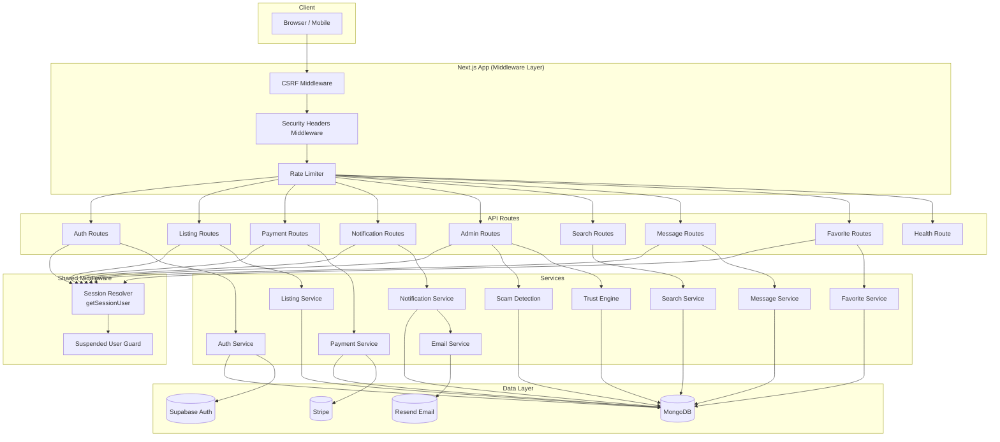

# Design Document: Webapp Full Audit

## Overview

This design covers a comprehensive audit of the Apartment Finder webapp — a Next.js 15 + MongoDB + Supabase Auth rental platform for European expats. The audit spans eight domains: authentication/security hardening, session management, database health, performance, missing features, email infrastructure, listing moderation, and UI/UX polish.

The existing codebase uses:
- **Frontend**: Next.js 15 (App Router), React 19, Redux Toolkit, Tailwind CSS 4, next-intl for i18n
- **Backend**: Next.js API routes, Mongoose ODM, Supabase Auth (httpOnly cookie tokens), Stripe payments
- **Testing**: Vitest + fast-check (property-based testing), Testing Library, MSW

The audit addresses critical security vulnerabilities (session tokens never refresh, admin routes accept client-supplied IDs, an exposed admin-reset endpoint), infrastructure gaps (in-memory rate limiting, missing DB indexes, no email delivery), and missing platform features (favorites, messaging, user profiles, listing expiration).

### Design Principles

1. **Session-derived identity everywhere**: All API routes derive user identity from httpOnly cookies, never from request parameters
2. **Defense in depth**: CSRF validation, security headers, rate limiting, and suspended-user checks form layered security
3. **Fail-safe defaults**: Rate limiter falls back to in-memory when the store is unavailable; search returns empty on timeout
4. **Minimal surface area**: Remove the admin-reset endpoint entirely; restrict write operations for suspended users

## Architecture

The existing architecture is a monolithic Next.js application with API routes acting as the backend. This audit preserves that architecture while introducing cross-cutting middleware layers.



### Key Architectural Changes

1. **Next.js Middleware** (`middleware.ts`): A single edge middleware handles CSRF validation, security headers, and rate limiting for all routes. This replaces per-route checks.

2. **`getSessionUser()` utility**: A shared function in `src/lib/api/session.ts` that extracts the user from cookies, attempts token refresh if expired, and returns the authenticated user + MongoDB record. All authenticated routes call this instead of reading `userId` from query params.

3. **Persistent rate limiting**: The `RateLimiter` moves from an in-memory `Map` to MongoDB (with optional Redis upgrade path). A `RateLimit` collection stores counters with TTL indexes for automatic expiry.

4. **Email service layer**: A new `src/lib/services/email.ts` wraps Resend with HTML templates, retry logic, and delivery logging via a new `EmailLog` model.

5. **New feature modules**: Favorites, Messaging, and User Profiles are added as new service + route + model combinations following the existing patterns.

## Components and Interfaces

### 1. Session Resolver (`src/lib/api/session.ts`)

```typescript
interface SessionUser {
  supabaseId: string;
  mongoId: string;
  email: string;
  role: "seeker" | "poster" | "admin";
  isSuspended: boolean;
  suspensionReason?: string;
}

// Extracts user from cookies, refreshes token if expired, returns user or null
async function getSessionUser(): Promise<SessionUser | null>;

// Requires authenticated user, throws 401 if not found
async function requireSessionUser(): Promise<SessionUser>;

// Requires admin role, throws 401/403 as appropriate
async function requireAdmin(): Promise<SessionUser>;

// Requires non-suspended user for write operations, throws 403 if suspended
async function requireActiveUser(): Promise<SessionUser>;
```

### 2. CSRF Middleware (in `middleware.ts`)

Validates `Origin` or `Referer` headers on POST/PUT/DELETE requests against `process.env.NEXT_PUBLIC_APP_URL`. Returns 403 on mismatch.

### 3. Security Headers (in `next.config.ts`)

Configured via Next.js `headers()` config to apply on all routes:
- `X-Content-Type-Options: nosniff`
- `X-Frame-Options: DENY`
- `Strict-Transport-Security: max-age=31536000; includeSubDomains` (production only)
- `Referrer-Policy: strict-origin-when-cross-origin`
- `Content-Security-Policy: default-src 'self'; script-src 'self' ...`

### 4. Rate Limiter (`src/lib/api/rate-limit.ts` — refactored)

```typescript
interface RateLimitConfig {
  windowMs: number;
  maxRequests: number;
}

const AUTH_RATE_LIMITS: Record<string, RateLimitConfig> = {
  "/api/auth/login": { windowMs: 60000, maxRequests: 10 },
  "/api/auth/register": { windowMs: 60000, maxRequests: 5 },
  "/api/auth/reset-password": { windowMs: 60000, maxRequests: 3 },
};

interface RateLimitResult {
  allowed: boolean;
  remaining: number;
  retryAfterSeconds?: number;
}

async function checkRateLimit(ip: string, route: string): Promise<RateLimitResult>;
```

Storage: MongoDB `ratelimits` collection with TTL index on `expiresAt`. Falls back to in-memory `Map` if MongoDB is unreachable.

### 5. Email Service (`src/lib/services/email.ts`)

```typescript
interface EmailSendOptions {
  to: string;
  template: "verification" | "password_reset" | "payment_confirmation" | "report_resolution";
  locale: string;
  data: Record<string, unknown>;
}

interface EmailLogEntry {
  recipient: string;
  template: string;
  status: "sent" | "failed" | "bounced";
  attempts: number;
  lastAttemptAt: Date;
  error?: string;
}

async function sendEmail(options: EmailSendOptions): Promise<{ success: boolean; error?: string }>;
```

Retry: Up to 3 attempts with exponential backoff (1s, 4s, 16s). Hard bounces (invalid address) are not retried. On final failure, creates an in-app notification as fallback.

### 6. Message Service (`src/lib/services/messages.ts`)

```typescript
interface IMessage {
  threadId: ObjectId;
  senderId: ObjectId;
  body: string;
  createdAt: Date;
}

interface IMessageThread {
  listingId: ObjectId;
  participants: [ObjectId, ObjectId]; // seeker, poster
  lastMessageAt: Date;
  createdAt: Date;
}

async function sendMessage(senderId: string, listingId: string, body: string): Promise<{ message: IMessage | null; error: string | null }>;
async function getThreads(userId: string): Promise<{ threads: IMessageThread[]; error: string | null }>;
async function getMessages(threadId: string, userId: string): Promise<{ messages: IMessage[]; error: string | null }>;
```

### 7. Favorite Service (`src/lib/services/favorites.ts`)

```typescript
interface IFavorite {
  userId: ObjectId;
  listingId: ObjectId;
  savedAt: Date;
}

async function addFavorite(userId: string, listingId: string): Promise<{ error: string | null }>;
async function removeFavorite(userId: string, listingId: string): Promise<{ error: string | null }>;
async function getFavorites(userId: string): Promise<{ favorites: IFavorite[]; error: string | null }>;
async function isFavorited(userId: string, listingId: string): Promise<boolean>;
```

### 8. Health Endpoint (`src/app/api/health/route.ts`)

```typescript
interface HealthStatus {
  status: "healthy" | "degraded" | "unhealthy";
  mongodb: "connected" | "disconnected";
  supabase: "reachable" | "unreachable";
  version: string;
  timestamp: string;
}
```

### 9. Password Validation (enhanced `src/lib/validations/auth.ts`)

```typescript
const passwordSchema = z.string()
  .min(8, "Password must be at least 8 characters")
  .max(128, "Password must be at most 128 characters")
  .regex(/[A-Z]/, "Password must contain at least one uppercase letter")
  .regex(/[a-z]/, "Password must contain at least one lowercase letter")
  .regex(/[0-9]/, "Password must contain at least one digit")
  .regex(/[^A-Za-z0-9]/, "Password must contain at least one special character");
```

### 10. Listing Expiration (cron/scheduled task or on-query filter)

The `Search_Engine` excludes listings older than 90 days by adding `createdAt: { $gte: ninetyDaysAgo }` to all search queries. A scheduled function (or API route triggered by cron) archives expired listings and sends 7-day-before-expiry notifications.

### 11. User Profile Page (`src/app/users/[id]/page.tsx`)

Displays trust score, badge, recent reviews, active listings, member-since date, profile completeness, and a "flagged" indicator for suspended users. Data fetched from existing Trust Engine and Listing Service.

### 12. Admin Scam Review Dashboard (`src/app/admin/scam-review/page.tsx`)

Displays listings with `scamRiskLevel` of "medium" or "high". Each entry shows scam flags, poster trust score, confirmed scam count, reverse image search links, map pin, and listing metadata. Admin can approve (sets status to "active", risk to "low") or reject (archives and notifies poster).

## Data Models

### New Models

#### RateLimit (`src/lib/db/models/RateLimit.ts`)
```typescript
interface IRateLimit {
  key: string;        // "ip:route" composite key
  count: number;
  expiresAt: Date;    // TTL index for auto-deletion
}
// Index: { key: 1 } unique, { expiresAt: 1 } TTL
```

#### EmailLog (`src/lib/db/models/EmailLog.ts`)
```typescript
interface IEmailLog {
  recipient: string;
  template: string;
  status: "sent" | "failed" | "bounced";
  attempts: number;
  lastAttemptAt: Date;
  error?: string;
  createdAt: Date;
}
// Index: { recipient: 1, createdAt: -1 }
```

#### MessageThread (`src/lib/db/models/MessageThread.ts`)
```typescript
interface IMessageThread {
  listingId: ObjectId;
  participants: [ObjectId, ObjectId];
  lastMessageAt: Date;
  createdAt: Date;
}
// Index: { participants: 1 }, { listingId: 1, participants: 1 }
```

#### Message (`src/lib/db/models/Message.ts`)
```typescript
interface IMessage {
  threadId: ObjectId;
  senderId: ObjectId;
  body: string;
  createdAt: Date;
}
// Index: { threadId: 1, createdAt: 1 }
```

#### Favorite (`src/lib/db/models/Favorite.ts`)
```typescript
interface IFavorite {
  userId: ObjectId;
  listingId: ObjectId;
  savedAt: Date;
}
// Index: { userId: 1, savedAt: -1 }, { userId: 1, listingId: 1 } unique
```

### Modified Models

#### Listing — add fields:
- `expiresAt: Date` — set to `createdAt + 90 days`, reset on renewal
- `renewedAt?: Date` — last renewal timestamp

#### Notification — add index:
- `{ userId: 1, isRead: 1, isDismissed: 1, createdAt: -1 }` (compound, replaces existing partial index)

#### Payment — add compound indexes:
- `{ seekerId: 1, status: 1 }`
- `{ posterId: 1, status: 1 }`
(Replace existing single-field indexes)

#### User — add field:
- `bio?: string` — optional profile bio for the public profile page

